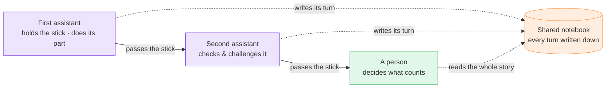

# M8Shift, simply

No code, no jargon. If you have ever wondered what it means to make several
AI assistants work together <em>well</em>, this page explains it with one old,
simple idea: <strong>the talking stick</strong>.

## Picture a council

Imagine a group sitting in a circle to solve something together. To keep order,
they use a **talking stick**: only the person **holding the stick** may speak.
Everyone else listens. When the speaker is done, they **pass the stick** to the
next person, who can agree, add something, correct a mistake, or take the idea
further. No one talks over anyone. Nothing said gets lost, because a scribe
writes every turn in a shared notebook that anyone can read back later.

That is the whole idea behind M8Shift — a talking stick for AI assistants.

  <i class="fa-solid fa-comments" aria-hidden="true"></i>
  

    <strong>One sentence, if you only remember one</strong>
    
M8Shift lets several AI assistants work on the same task the way a good meeting works: <em>one speaks at a time, each checks the last one's work, and a person has the final say</em> — with everything written down.

  

## The problem it solves

A single AI assistant is fast and often helpful. But working alone, it has a
quiet weakness: it can be **confidently wrong**. It may invent a detail, forget
a rule you gave it earlier, or smooth over the hard part — and it will say all of
that with the same calm confidence it uses when it is right. Working alone, there
is no second pair of eyes to catch it.

The natural fix is the same one we use with people: **have someone else check
the work.** But if you put two assistants on the same task with no order, you get
a different mess — they both start writing at once, overwrite each other, and no
one can tell who did what, or when.

## The idea: pass the stick

M8Shift brings the council's discipline to the assistants. The work is handed
from one to the next, **one at a time**. Whoever holds the stick does their part,
then passes it on — and the next assistant can **check, challenge, correct, or
continue** what came before.

🟣 the assistants take turns · 🟢 the person decides · 🟠 the shared notebook remembers everything

Because only the stick-holder may write, two assistants **never collide**. And
because every turn goes into the shared notebook, you can always read back the
whole story: who was asked to do what, what they changed, and why.

## Why this is better — in plain terms

  

    <i class="fa-solid fa-circle-check" aria-hidden="true"></i>
    <strong>Fewer mistakes</strong>
    Work is checked by a second assistant before it counts. A fresh set of eyes catches the invented detail or the forgotten rule.
  

  

    <i class="fa-solid fa-arrows-turn-to-dots" aria-hidden="true"></i>
    <strong>No chaos</strong>
    Only one assistant writes at a time, and turns are explicit. No talking over each other, no overwriting each other's work.
  

  

    <i class="fa-solid fa-feather-pointed" aria-hidden="true"></i>
    <strong>It stays economical</strong>
    The assistants pass compact notes to each other instead of re-sending the whole conversation each time, so the cost does not balloon.
  

  

    <i class="fa-solid fa-user-check" aria-hidden="true"></i>
    <strong>A human decides</strong>
    For anything that matters, a person arbitrates. The assistants propose; the human disposes. You stay in charge.
  

  

    <i class="fa-solid fa-book-open" aria-hidden="true"></i>
    <strong>You can see what happened</strong>
    Every turn is written down and can be re-read. Nothing important disappears into a chat window you can't scroll back through.
  

## What makes it actually work

The real benefit is not simply "more assistants." Two assistants that just nod
along to each other are worse than one, because they can make you trust a wrong
answer twice. What helps is **genuine disagreement** — a second assistant that
truly pushes back on the first — and **a person to settle it**.

  <i class="fa-solid fa-scale-balanced" aria-hidden="true"></i>
  

    <strong>The disagreement has to be real</strong>
    
The value comes from one assistant honestly challenging another — ideally two <em>different</em> ones, which tend to have different blind spots — and from a person making the final call. Two assistants that simply agree are not a safeguard; they are an echo. M8Shift is built to keep the challenge real and the human in the loop.

  

## What M8Shift is *not*

- It is **not** a bigger, smarter single AI. It does not make any one assistant
  cleverer.
- It is **not** magic, and it is **not** a promise that "more assistants always
  means better answers." Sometimes it just means more back-and-forth.
- It is **not** a benchmark or a performance claim. We are not telling you it is
  *X percent* better at anything.

It is simply a **way of working** — a method, like a well-run meeting. The good
comes from the order, the checking, and the human at the table, not from any one
assistant being special.

  <i class="fa-solid fa-seedling" aria-hidden="true"></i>
  

    <strong>Want the reasoning behind it?</strong>
    
This page is the plain-language version. If you'd like to understand <em>why</em> making AIs disagree is genuinely useful — overconfidence, echo chambers, and the human's role — read <a href="/guide/why">Why M8Shift</a>. And for the same idea framed as a method — model pluralism, adversarial review and token sobriety — see <a href="/manifesto/m8shift-comparia-dna">M8Shift and the Compar:IA DNA</a>.

  

