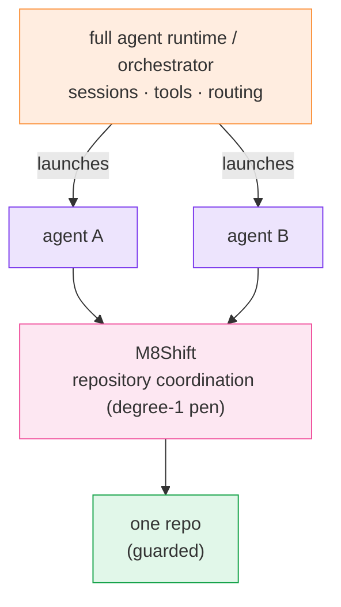

# Comparison

  <a class="m8-doc-card" href="/comparison">
    <i class="fa-solid fa-pen-nib" aria-hidden="true"></i>
    <strong>M8Shift</strong>
    Local repository coordination, one explicit writer, append-only handoffs, no model credentials.
  </a>
  <a class="m8-doc-card" href="/comparison">
    <i class="fa-solid fa-server" aria-hidden="true"></i>
    <strong>Agent runtime</strong>
    Sessions, tools, model routing, memory, credentials, and long-lived host state.
  </a>
  <a class="m8-doc-card" href="/guide/worktree-toolbox">
    <i class="fa-solid fa-code-branch" aria-hidden="true"></i>
    <strong>Complementary</strong>
    Use runtimes to launch agents and M8Shift to guard shared repository ownership.
  </a>

  <i class="fa-solid fa-scale-balanced" aria-hidden="true"></i>
  

    <strong>Decision rule</strong>
    
If the question is “who may write to this repository right now?”, M8Shift is in scope. If the question is “which model should run next?”, use an agent runtime.

  

## M8Shift and agent orchestrators

| | M8Shift | Full agent runtime / orchestrator |
| --- | --- | --- |
| Primary job | coordinate repository work | run and route agents |
| Runtime | passive local CLI | long-lived service or host runtime |
| Credentials | none for M8Shift itself | provider and integration credentials |
| State | local readable journal | sessions, databases, runtime state |
| Repository ownership | one explicit pen (degree-1 mutex) | depends on runtime/tool design |
| Handoffs | immutable turn journal | usually runtime-specific |
| Model launching | <i class="fa-solid fa-xmark m8-no" aria-label="No"></i> | <i class="fa-solid fa-check m8-ok" aria-label="Yes"></i> |
| Complementary? | <i class="fa-solid fa-check m8-ok" aria-label="Yes"></i> | <i class="fa-solid fa-check m8-ok" aria-label="Yes"></i> |

A full agent runtime is typically a self-hosted gateway with sessions, tools, memory,
channels, and multi-agent routing. M8Shift sits lower in the stack as a repository
coordination layer for agents launched by such a runtime — not a replacement for it.

*🟠 runtime · 🟣 agents · 🩷 M8Shift · 🟢 guarded repo*

## Named tools and where they fit

  <i class="fa-solid fa-circle-info" aria-hidden="true"></i>
  

    <strong>Not a benchmark</strong>
    
This is a positioning guide, not a quality ranking. Most tools below solve a different layer of the stack: they build, host, run, route, or automate agents. M8Shift only answers repository coordination and handoff ownership.

  

  <article class="m8-tool-card">
    <header><i class="fa-solid fa-robot" aria-hidden="true"></i><h3><a href="https://openclaw.ai/">OpenClaw</a></h3>No</header>
    <dl>
<dt>What it is</dt><dd>Personal AI assistant and local gateway for actions across channels such as chat apps, inbox, calendar, device apps, and skills.</dd>

<dt>Comparable to M8Shift?</dt><dd><strong>No.</strong> It is an assistant product/control plane. M8Shift is a repository-local relay.</dd>

<dt>Use with M8Shift</dt><dd>Use OpenClaw to run or expose an assistant; use M8Shift inside a code repository when that assistant must coordinate with coding agents.</dd>
</dl>
  </article>
  <article class="m8-tool-card">
    <header><i class="fa-solid fa-diagram-project" aria-hidden="true"></i><h3><a href="https://docs.langchain.com/oss/python/langgraph/overview">LangGraph</a></h3>Partial</header>
    <dl>
<dt>What it is</dt><dd>Low-level orchestration runtime for long-running, stateful agents with durable execution, persistence, streaming, and human-in-the-loop support.</dd>

<dt>Comparable to M8Shift?</dt><dd><strong>Partly, but at another layer.</strong> LangGraph orchestrates agent execution; M8Shift serializes repository write ownership.</dd>

<dt>Use with M8Shift</dt><dd>Use LangGraph to decide which agent step runs next, then make repository-writing steps acquire and hand off through M8Shift.</dd>
</dl>
  </article>
  <article class="m8-tool-card">
    <header><i class="fa-solid fa-comments" aria-hidden="true"></i><h3><a href="https://github.com/microsoft/autogen">AutoGen</a></h3>Historical</header>
    <dl>
<dt>What it is</dt><dd>Microsoft multi-agent framework for autonomous or human-assisted AI applications. The GitHub project is now marked maintenance mode.</dd>

<dt>Comparable to M8Shift?</dt><dd><strong>Historical/partial.</strong> AutoGen models agent conversations and runtimes; it does not replace a repo-level pen.</dd>

<dt>Use with M8Shift</dt><dd>Existing AutoGen agents can call M8Shift before touching a shared repository. For new Microsoft work, also compare <a href="https://learn.microsoft.com/en-us/agent-framework/overview/">Microsoft Agent Framework</a>.</dd>
</dl>
  </article>
  <article class="m8-tool-card">
    <header><i class="fa-solid fa-sitemap" aria-hidden="true"></i><h3><a href="https://learn.microsoft.com/en-us/agent-framework/overview/">Microsoft Agent Framework</a></h3>Complementary</header>
    <dl>
<dt>What it is</dt><dd>Successor direction for Microsoft agent orchestration, with .NET/Python agents, workflows, state management, telemetry, and multi-agent patterns.</dd>

<dt>Comparable to M8Shift?</dt><dd><strong>Complementary.</strong> It is an application/runtime framework; M8Shift is a repository coordination primitive.</dd>

<dt>Use with M8Shift</dt><dd>Use Agent Framework for workflow orchestration and M8Shift as the local contract for who may write to a repo at a given moment.</dd>
</dl>
  </article>
  <article class="m8-tool-card">
    <header><i class="fa-solid fa-users-gear" aria-hidden="true"></i><h3><a href="https://docs.crewai.com/">CrewAI</a></h3>Partial</header>
    <dl>
<dt>What it is</dt><dd>Framework/platform for agents, crews, flows, tools, memory, knowledge, guardrails, observability, and automations.</dd>

<dt>Comparable to M8Shift?</dt><dd><strong>Partly, but broader.</strong> CrewAI coordinates agent work; M8Shift coordinates write access and handoff records for one repository.</dd>

<dt>Use with M8Shift</dt><dd>Let CrewAI manage roles and tasks; require any crew member that changes the repo to claim, append, and record evidence through M8Shift.</dd>
</dl>
  </article>
  <article class="m8-tool-card">
    <header><i class="fa-solid fa-code" aria-hidden="true"></i><h3><a href="https://www.openhands.dev/">OpenHands</a></h3>Closest</header>
    <dl>
<dt>What it is</dt><dd>Software-development agent platform that runs autonomous coding agents, often in isolated local, VM, cloud, or enterprise environments.</dd>

<dt>Comparable to M8Shift?</dt><dd><strong>Closest domain overlap.</strong> It targets end-to-end coding work; M8Shift is smaller and only guards shared repository coordination.</dd>

<dt>Use with M8Shift</dt><dd>Use OpenHands when you want a full coding-agent platform. Use M8Shift when multiple agents, including OpenHands-style agents, need a simple shared-repo mutex and audit trail.</dd>
</dl>
  </article>
  <article class="m8-tool-card">
    <header><i class="fa-solid fa-cubes" aria-hidden="true"></i><h3><a href="https://developers.openai.com/api/docs/guides/agents">OpenAI Agents SDK</a></h3>Complementary</header>
    <dl>
<dt>What it is</dt><dd>SDK for applications that own agent orchestration, tool execution, approvals, state, and multi-agent collaboration.</dd>

<dt>Comparable to M8Shift?</dt><dd><strong>Complementary.</strong> It builds agent applications; M8Shift keeps repository handoffs explicit and local.</dd>

<dt>Use with M8Shift</dt><dd>Use the SDK for model/tool orchestration. Add M8Shift commands around filesystem mutations when several agents share a repository.</dd>
</dl>
  </article>
  <article class="m8-tool-card">
    <header><i class="fa-solid fa-layer-group" aria-hidden="true"></i><h3><a href="https://docs.dify.ai/en/home">Dify</a></h3>No</header>
    <dl>
<dt>What it is</dt><dd>Open-source platform for AI applications, agents, agentic workflows, chatbots, data-backed apps, and API publishing.</dd>

<dt>Comparable to M8Shift?</dt><dd><strong>No, except as adjacent workflow infrastructure.</strong> Dify builds and serves AI apps; M8Shift coordinates repository work.</dd>

<dt>Use with M8Shift</dt><dd>Use Dify for product-facing AI workflows. If a Dify-triggered agent edits a repo, have that execution respect M8Shift.</dd>
</dl>
  </article>
  <article class="m8-tool-card">
    <header><i class="fa-solid fa-shuffle" aria-hidden="true"></i><h3><a href="https://docs.n8n.io/advanced-ai/">n8n AI workflows</a></h3>No</header>
    <dl>
<dt>What it is</dt><dd>Workflow automation platform with AI workflow, chatbot, LangChain, and integration nodes.</dd>

<dt>Comparable to M8Shift?</dt><dd><strong>No.</strong> n8n is deterministic/automation infrastructure; M8Shift is a local protocol for coding-agent turn-taking.</dd>

<dt>Use with M8Shift</dt><dd>Use n8n to trigger jobs, notifications, and integrations. Use M8Shift only when those jobs enter a shared code repository.</dd>
</dl>
  </article>

## Short version

  <a class="m8-doc-card" href="/reference/features">
    <i class="fa-solid fa-pen-nib" aria-hidden="true"></i>
    <strong>M8Shift</strong>
    Best when the hard question is who owns repository writes and how the handoff is recorded.
  </a>
  <a class="m8-doc-card" href="https://docs.langchain.com/oss/python/langgraph/overview">
    <i class="fa-solid fa-diagram-project" aria-hidden="true"></i>
    <strong>LangGraph / MAF</strong>
    Best when the hard question is durable graph/workflow orchestration.
  </a>
  <a class="m8-doc-card" href="https://docs.crewai.com/">
    <i class="fa-solid fa-users-gear" aria-hidden="true"></i>
    <strong>CrewAI / AutoGen</strong>
    Best when the hard question is how agents, roles, tools, and conversations collaborate.
  </a>
  <a class="m8-doc-card" href="https://www.openhands.dev/">
    <i class="fa-solid fa-code" aria-hidden="true"></i>
    <strong>OpenHands</strong>
    Best when the hard question is running autonomous coding agents as a platform.
  </a>

