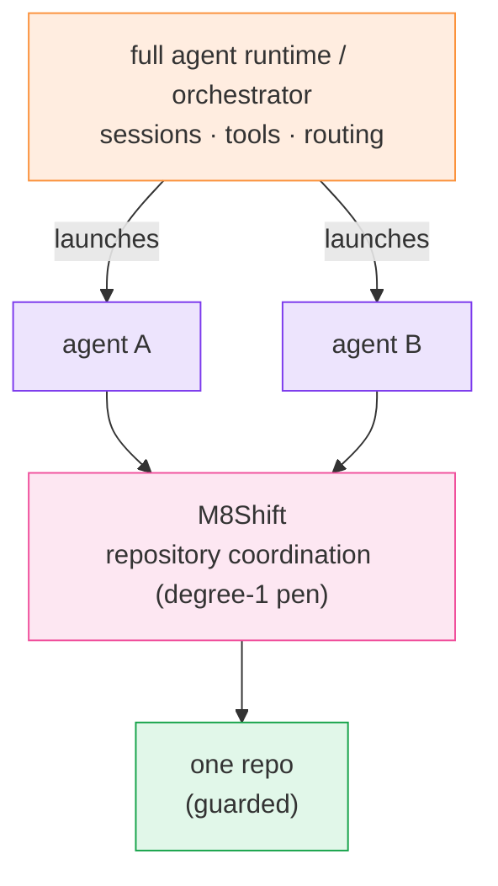

# Comparison

  <a class="m8-doc-card" href="/comparison">
    <i class="fa-solid fa-pen-nib" aria-hidden="true"></i>
    <strong>M8Shift</strong>
    Local repository coordination, one explicit writer, append-only handoffs, no model credentials.
  </a>
  <a class="m8-doc-card" href="/comparison">
    <i class="fa-solid fa-server" aria-hidden="true"></i>
    <strong>Agent runtime</strong>
    Sessions, tools, model routing, memory, credentials, and long-lived host state.
  </a>
  <a class="m8-doc-card" href="/guide/worktree-toolbox">
    <i class="fa-solid fa-code-branch" aria-hidden="true"></i>
    <strong>Complementary</strong>
    Use runtimes to launch agents and M8Shift to guard shared repository ownership.
  </a>

  <i class="fa-solid fa-scale-balanced" aria-hidden="true"></i>
  

    <strong>Decision rule</strong>
    
If the question is “who may write to this repository right now?”, M8Shift is in scope. If the question is “which model should run next?”, use an agent runtime.

  

## M8Shift and agent orchestrators

| | M8Shift | Full agent runtime / orchestrator |
| --- | --- | --- |
| Primary job | coordinate repository work | run and route agents |
| Runtime | passive local CLI | long-lived service or host runtime |
| Credentials | none for M8Shift itself | provider and integration credentials |
| State | local readable journal | sessions, databases, runtime state |
| Repository ownership | one explicit pen (degree-1 mutex) | depends on runtime/tool design |
| Handoffs | immutable turn journal | usually runtime-specific |
| Model launching | <i class="fa-solid fa-xmark m8-no" aria-label="No"></i> | <i class="fa-solid fa-check m8-ok" aria-label="Yes"></i> |
| Complementary? | <i class="fa-solid fa-check m8-ok" aria-label="Yes"></i> | <i class="fa-solid fa-check m8-ok" aria-label="Yes"></i> |

A full agent runtime is typically a self-hosted gateway with sessions, tools, memory,
channels, and multi-agent routing. M8Shift sits lower in the stack as a repository
coordination layer for agents launched by such a runtime — not a replacement for it.

*🟠 runtime · 🟣 agents · 🩷 M8Shift · 🟢 guarded repo*
