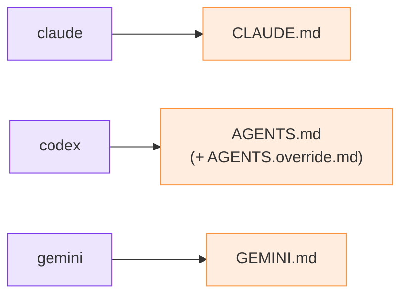

# Agents and roles

## The roster

You declare the relay's agents at `init`:

```bash
python3 m8shift.py init --agents claude,codex,gemini
```

The list is stored in the lock's `agents:` field. Any listed agent can receive the
shared pen; the relay remains degree 1, so exactly one agent writes in the shared
repository at a time.

Each agent gets a canonical **anchor** file where the protocol stanza is injected:

| Agent | Anchor |
| --- | --- |
| `claude` | `CLAUDE.md` |
| `codex`, `lechat`, `mistral` | `AGENTS.md` (+ `AGENTS.override.md` if present) |
| `gemini` | `GEMINI.md` |

The stanza is injected idempotently at the top of the file; the previous content is
backed up to `<anchor>.m8shift.bak`.



*🟣 agents · 🟠 anchor files*

## Roles are conventions

M8Shift records the roster identity that holds or receives the pen. Higher-level roles
such as architect, implementer, reviewer, or integrator are conventions expressed in the
turn's `ask`, `next`, task ledger, or prompt. The core CLI does not enforce role
permissions.
