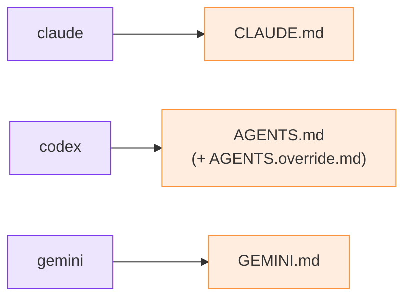

# Agents and roles

## The roster (shipped)

You declare the relay's agents at `init`:

```bash
python3 m8shift.py init --agents claude,codex
```

The list is stored in the lock's `agents:` field. The **first two** are the active pair;
any extras are recorded but inactive (reserved for a future N-agent mode). The relay is
strictly degree one — two agents, one pen, in alternation.

Each agent gets a canonical **anchor** file where the protocol stanza is injected:

| Agent | Anchor |
| --- | --- |
| `claude` | `CLAUDE.md` |
| `codex`, `lechat`, `mistral` | `AGENTS.md` (+ `AGENTS.override.md` if present) |
| `gemini` | `GEMINI.md` |

The stanza is injected idempotently at the top of the file; the previous content is
backed up to `<anchor>.cowork.bak`.



*🟣 agents · 🟠 anchor files*

## Roles (specified)

::: tip Specified, not shipped
A richer **role** vocabulary — an agent acting as architect, implementer, reviewer or
integrator, with one active role per turn — is a [roadmap](/roadmap) direction. In the
shipped relay, an agent is simply its roster identity; "who does what" is expressed in
the turn's `ask`, not a formal role field.
:::
