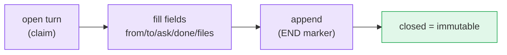

# Handoff contracts

A handoff is a **turn**: a numbered, immutable record of what happened and what is asked
next. It turns an informal "your turn now" into a durable, greppable unit of work.

The shipped turn carries `from`, `to`, `ask`, `done`, `files`, and `handoff` — see the
full [turn schema](/reference/contract-schema) for the exact format and validation rules.

```text
<!-- M8SHIFT:TURN 4 claude BEGIN -->
from: claude
to: codex
ask: Implement the parser and keep legacy behaviour.
done: Defined the parser contract and added tests.
files: docs/spec.md, tests/test_parser.py
handoff: codex
<!-- M8SHIFT:TURN 4 claude END -->
```



*🟣 active steps · 🟢 closed (immutable)*

Two principles hold:

- **A closed turn is immutable.** The tool never rewrites a turn once its `END` marker
  is set, so the journal is an honest, append-only history.
- **Contracts are data, not commands.** M8Shift never executes a path, test command,
  branch name, or commit field merely because it appears in the journal.

::: tip Specified, not shipped
Richer contract fields — explicit `permissions`, `expected_output`, and structured
`branch`/`commit`/`tests` — are on the [roadmap](/roadmap), not in the current turn.
:::
