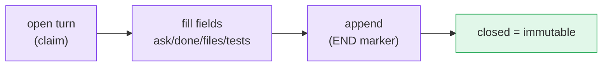

# Handoff contracts

A handoff is a **turn**: a numbered, immutable record of what happened and what is asked
next. It turns an informal "your turn now" into a durable, greppable unit of work.

The shipped turn carries core fields (`from`, `to`, `ask`, `done`, `files`, `handoff`),
optional advisory fields such as `branch`, `commit`, `tests`, `next`, `blocked_on`,
custom `x_*` fields, and Stage-4 contract fields such as `schema`, `relation`,
`requires`, `expected_output`, `evidence`, and `decision`. See the full
[turn schema](/reference/contract-schema).

```text
<!-- M8SHIFT:TURN 4 claude BEGIN -->
from: claude
to: codex
ask: Implement the parser and keep legacy behaviour.
done: Defined the parser contract and added tests.
files: docs/spec.md, tests/test_parser.py
branch: parser-contract
tests: python3 -m unittest discover -s tests
schema: stage4.v1
relation: review_request
requires: read code and tests
expected_output: approve/revise/reject/waive
handoff: codex
<!-- M8SHIFT:TURN 4 claude END -->
```



*🟣 active steps · 🟢 closed (immutable)*

Two principles hold:

- **A closed turn is immutable.** The tool never rewrites a turn once its `END` marker
  is set, so the journal is an honest, append-only history.
- **Contracts are data, not commands.** M8Shift never executes a path, test command,
  branch name, commit field, or custom field merely because it appears in the journal.
- **Contract validation is read-only.** `contract validate` and `doctor --contracts` report
  shape/completeness issues without routing work or granting permissions.
