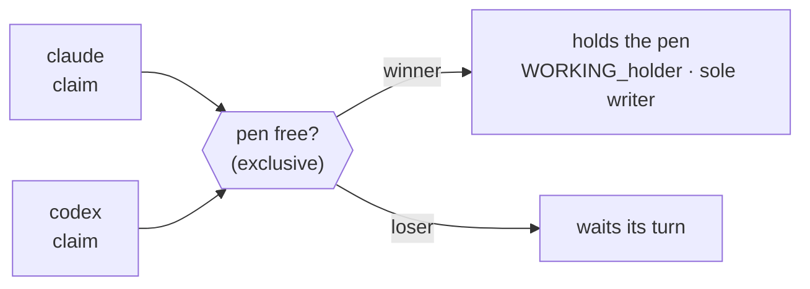

# The pen

The pen represents exclusive write ownership. There is exactly one pen, and it guards
the whole shared working tree: at any moment at most one agent holds it, and only the
holder may modify the repository.

Acquiring the pen is the `claim` command. It is exclusive — if two agents claim at the
same time, exactly one wins; the other waits. This is a cooperative mutex of **degree
one** (a mutex, not a semaphore): strict alternation, never two writers.

The pen is **cooperative and advisory**. It prevents conflicts only when agents follow
the protocol; it cannot stop a process that ignores it or edits files directly.
