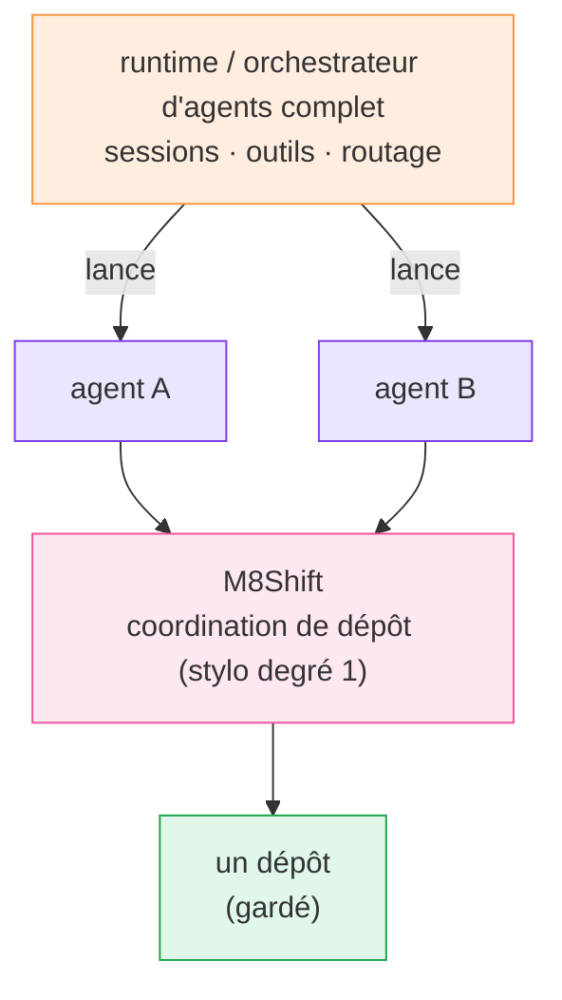

# Comparaison

  <a class="m8-doc-card" href="/fr/comparison">
    <i class="fa-solid fa-pen-nib" aria-hidden="true"></i>
    <strong>M8Shift</strong>
    Coordination locale du dépôt, un rédacteur explicite, passations en ajout seul, aucun identifiant modèle.
  </a>
  <a class="m8-doc-card" href="/fr/comparison">
    <i class="fa-solid fa-server" aria-hidden="true"></i>
    <strong>Runtime d'agents</strong>
    Sessions, outils, routage modèle, mémoire, identifiants et état hôte durable.
  </a>
  <a class="m8-doc-card" href="/fr/guide/worktree-toolbox">
    <i class="fa-solid fa-code-branch" aria-hidden="true"></i>
    <strong>Complémentaire</strong>
    Utilisez les runtimes pour lancer les agents et M8Shift pour garder la propriété du dépôt.
  </a>

  <i class="fa-solid fa-scale-balanced" aria-hidden="true"></i>
  

    <strong>Règle de décision</strong>
    
Si la question est « qui peut écrire dans ce dépôt maintenant ? », M8Shift est dans le périmètre. Si la question est « quel modèle doit tourner ensuite ? », utilisez un runtime d'agents.

  

## M8Shift et les orchestrateurs d'agents

| | M8Shift | Runtime / orchestrateur d'agents complet |
| --- | --- | --- |
| Rôle principal | coordonner le travail sur le dépôt | exécuter et router les agents |
| Runtime | CLI locale passive | service durable ou runtime hôte |
| Identifiants | aucun pour M8Shift lui-même | identifiants de fournisseurs et d'intégrations |
| État | journal local lisible | sessions, bases de données, état d'exécution |
| Propriété du dépôt | un stylo explicite unique (mutex de degré 1) | dépend de la conception du runtime/outil |
| Passations | journal de tours immuable | généralement propre au runtime |
| Lancement de modèles | <i class="fa-solid fa-xmark m8-no" aria-label="Non"></i> | <i class="fa-solid fa-check m8-ok" aria-label="Oui"></i> |
| Complémentaire ? | <i class="fa-solid fa-check m8-ok" aria-label="Oui"></i> | <i class="fa-solid fa-check m8-ok" aria-label="Oui"></i> |

Un runtime d'agents complet est typiquement une passerelle auto-hébergée dotée de sessions, d'outils, de mémoire,
de canaux et de routage multi-agents. M8Shift se situe plus bas dans la pile, comme une couche de
coordination du dépôt pour les agents lancés par un tel runtime — non pas un remplacement de celui-ci.

*🟠 runtime · 🟣 agents · 🩷 M8Shift · 🟢 dépôt gardé*

## Outils nommés et positionnement

  <i class="fa-solid fa-circle-info" aria-hidden="true"></i>
  

    <strong>Ce n'est pas un benchmark</strong>
    
Ce guide positionne les outils, il ne les classe pas en qualité. La plupart résolvent une autre couche de la pile : construire, héberger, exécuter, router ou automatiser des agents. M8Shift répond seulement à la coordination du dépôt et à la propriété des passations.

  

  <article class="m8-tool-card">
    <header><i class="fa-solid fa-robot" aria-hidden="true"></i><h3><a href="https://openclaw.ai/">OpenClaw</a></h3>Non</header>
    <dl>
<dt>Ce que c'est</dt><dd>Assistant IA personnel et gateway locale pour agir via des canaux comme messageries, inbox, calendrier, apps de l'appareil et skills.</dd>

<dt>Comparable à M8Shift ?</dt><dd><strong>Non.</strong> C'est un produit d'assistant et un plan de contrôle. M8Shift est un relais local au dépôt.</dd>

<dt>Avec M8Shift</dt><dd>Utilisez OpenClaw pour exécuter ou exposer un assistant ; utilisez M8Shift dans un dépôt de code quand cet assistant doit se coordonner avec des agents de codage.</dd>
</dl>
  </article>
  <article class="m8-tool-card">
    <header><i class="fa-solid fa-diagram-project" aria-hidden="true"></i><h3><a href="https://docs.langchain.com/oss/python/langgraph/overview">LangGraph</a></h3>Partiel</header>
    <dl>
<dt>Ce que c'est</dt><dd>Runtime d'orchestration bas niveau pour agents longs et stateful, avec exécution durable, persistance, streaming et human-in-the-loop.</dd>

<dt>Comparable à M8Shift ?</dt><dd><strong>Partiellement, mais à une autre couche.</strong> LangGraph orchestre l'exécution des agents ; M8Shift sérialise la propriété d'écriture du dépôt.</dd>

<dt>Avec M8Shift</dt><dd>Utilisez LangGraph pour décider quelle étape d'agent tourne ensuite, puis faites passer les étapes qui écrivent dans le dépôt par M8Shift.</dd>
</dl>
  </article>
  <article class="m8-tool-card">
    <header><i class="fa-solid fa-comments" aria-hidden="true"></i><h3><a href="https://github.com/microsoft/autogen">AutoGen</a></h3>Historique</header>
    <dl>
<dt>Ce que c'est</dt><dd>Framework Microsoft multi-agents pour applications IA autonomes ou assistées par humain. Le projet GitHub est désormais marqué en maintenance mode.</dd>

<dt>Comparable à M8Shift ?</dt><dd><strong>Historique/partiel.</strong> AutoGen modélise conversations et runtimes d'agents ; il ne remplace pas un stylo au niveau du dépôt.</dd>

<dt>Avec M8Shift</dt><dd>Des agents AutoGen existants peuvent appeler M8Shift avant de toucher un dépôt partagé. Pour les nouveaux projets Microsoft, comparez aussi <a href="https://learn.microsoft.com/en-us/agent-framework/overview/">Microsoft Agent Framework</a>.</dd>
</dl>
  </article>
  <article class="m8-tool-card">
    <header><i class="fa-solid fa-sitemap" aria-hidden="true"></i><h3><a href="https://learn.microsoft.com/en-us/agent-framework/overview/">Microsoft Agent Framework</a></h3>Complémentaire</header>
    <dl>
<dt>Ce que c'est</dt><dd>Direction successeur pour l'orchestration Microsoft : agents .NET/Python, workflows, état, télémétrie et patterns multi-agents.</dd>

<dt>Comparable à M8Shift ?</dt><dd><strong>Complémentaire.</strong> C'est un framework applicatif/runtime ; M8Shift est une primitive de coordination du dépôt.</dd>

<dt>Avec M8Shift</dt><dd>Utilisez Agent Framework pour l'orchestration de workflows et M8Shift comme contrat local pour savoir qui peut écrire dans le dépôt à un instant donné.</dd>
</dl>
  </article>
  <article class="m8-tool-card">
    <header><i class="fa-solid fa-users-gear" aria-hidden="true"></i><h3><a href="https://docs.crewai.com/">CrewAI</a></h3>Partiel</header>
    <dl>
<dt>Ce que c'est</dt><dd>Framework/plateforme pour agents, crews, flows, outils, mémoire, knowledge, guardrails, observabilité et automatisations.</dd>

<dt>Comparable à M8Shift ?</dt><dd><strong>Partiellement, mais plus large.</strong> CrewAI coordonne le travail d'agents ; M8Shift coordonne l'accès en écriture et le journal des passations d'un dépôt.</dd>

<dt>Avec M8Shift</dt><dd>Laissez CrewAI gérer rôles et tâches ; exigez que tout membre qui modifie le dépôt claim, append et enregistre ses preuves via M8Shift.</dd>
</dl>
  </article>
  <article class="m8-tool-card">
    <header><i class="fa-solid fa-code" aria-hidden="true"></i><h3><a href="https://www.openhands.dev/">OpenHands</a></h3>Le plus proche</header>
    <dl>
<dt>Ce que c'est</dt><dd>Plateforme d'agents de développement logiciel qui exécute des agents autonomes, souvent en environnements locaux, VM, cloud ou entreprise isolés.</dd>

<dt>Comparable à M8Shift ?</dt><dd><strong>Le plus proche côté domaine.</strong> Il vise le travail de code de bout en bout ; M8Shift est plus petit et garde seulement la coordination du dépôt partagé.</dd>

<dt>Avec M8Shift</dt><dd>Utilisez OpenHands si vous voulez une plateforme complète d'agents de code. Utilisez M8Shift si plusieurs agents, y compris des agents de type OpenHands, ont besoin d'un mutex simple et d'une trace d'audit.</dd>
</dl>
  </article>
  <article class="m8-tool-card">
    <header><i class="fa-solid fa-cubes" aria-hidden="true"></i><h3><a href="https://developers.openai.com/api/docs/guides/agents">OpenAI Agents SDK</a></h3>Complémentaire</header>
    <dl>
<dt>Ce que c'est</dt><dd>SDK pour applications qui possèdent l'orchestration d'agents, l'exécution d'outils, les validations, l'état et la collaboration multi-agents.</dd>

<dt>Comparable à M8Shift ?</dt><dd><strong>Complémentaire.</strong> Il construit des applications d'agents ; M8Shift garde les passations de dépôt explicites et locales.</dd>

<dt>Avec M8Shift</dt><dd>Utilisez le SDK pour l'orchestration modèle/outils. Ajoutez les commandes M8Shift autour des mutations de fichiers quand plusieurs agents partagent un dépôt.</dd>
</dl>
  </article>
  <article class="m8-tool-card">
    <header><i class="fa-solid fa-layer-group" aria-hidden="true"></i><h3><a href="https://docs.dify.ai/en/home">Dify</a></h3>Non</header>
    <dl>
<dt>Ce que c'est</dt><dd>Plateforme open source pour applications IA, agents, workflows agentiques, chatbots, apps avec données et publication d'API.</dd>

<dt>Comparable à M8Shift ?</dt><dd><strong>Non, sauf comme infrastructure adjacente.</strong> Dify construit et sert des apps IA ; M8Shift coordonne le travail sur dépôt.</dd>

<dt>Avec M8Shift</dt><dd>Utilisez Dify pour des workflows IA orientés produit. Si une exécution déclenchée par Dify édite un dépôt, faites-lui respecter M8Shift.</dd>
</dl>
  </article>
  <article class="m8-tool-card">
    <header><i class="fa-solid fa-shuffle" aria-hidden="true"></i><h3><a href="https://docs.n8n.io/advanced-ai/">Workflows IA n8n</a></h3>Non</header>
    <dl>
<dt>Ce que c'est</dt><dd>Plateforme d'automatisation de workflows avec nœuds IA, chatbot, LangChain et intégrations.</dd>

<dt>Comparable à M8Shift ?</dt><dd><strong>Non.</strong> n8n est une infrastructure d'automatisation déterministe ; M8Shift est un protocole local de tour de rôle pour agents de code.</dd>

<dt>Avec M8Shift</dt><dd>Utilisez n8n pour déclencher jobs, notifications et intégrations. Utilisez M8Shift seulement quand ces jobs entrent dans un dépôt de code partagé.</dd>
</dl>
  </article>

## Version courte

  <a class="m8-doc-card" href="/fr/reference/features">
    <i class="fa-solid fa-pen-nib" aria-hidden="true"></i>
    <strong>M8Shift</strong>
    À choisir quand la vraie question est qui possède l'écriture dans le dépôt et comment la passation est tracée.
  </a>
  <a class="m8-doc-card" href="https://docs.langchain.com/oss/python/langgraph/overview">
    <i class="fa-solid fa-diagram-project" aria-hidden="true"></i>
    <strong>LangGraph / MAF</strong>
    À choisir quand la vraie question est l'orchestration durable de graphes ou workflows.
  </a>
  <a class="m8-doc-card" href="https://docs.crewai.com/">
    <i class="fa-solid fa-users-gear" aria-hidden="true"></i>
    <strong>CrewAI / AutoGen</strong>
    À choisir quand la vraie question est la collaboration entre agents, rôles, outils et conversations.
  </a>
  <a class="m8-doc-card" href="https://www.openhands.dev/">
    <i class="fa-solid fa-code" aria-hidden="true"></i>
    <strong>OpenHands</strong>
    À choisir quand la vraie question est l'exécution d'agents de code autonomes comme plateforme.
  </a>

