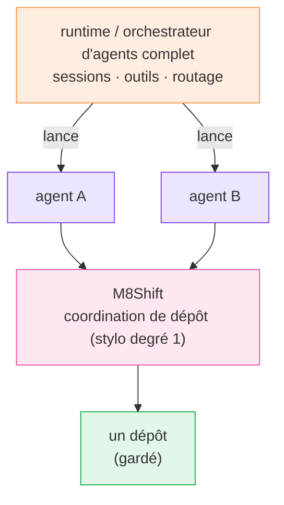

# Comparaison

  <a class="m8-doc-card" href="/fr/comparison">
    <i class="fa-solid fa-pen-nib" aria-hidden="true"></i>
    <strong>M8Shift</strong>
    Coordination locale du dépôt, un rédacteur explicite, passations en ajout seul, aucun identifiant modèle.
  </a>
  <a class="m8-doc-card" href="/fr/comparison">
    <i class="fa-solid fa-server" aria-hidden="true"></i>
    <strong>Runtime d'agents</strong>
    Sessions, outils, routage modèle, mémoire, identifiants et état hôte durable.
  </a>
  <a class="m8-doc-card" href="/fr/guide/worktree-toolbox">
    <i class="fa-solid fa-code-branch" aria-hidden="true"></i>
    <strong>Complémentaire</strong>
    Utilisez les runtimes pour lancer les agents et M8Shift pour garder la propriété du dépôt.
  </a>

  <i class="fa-solid fa-scale-balanced" aria-hidden="true"></i>
  

    <strong>Règle de décision</strong>
    
Si la question est « qui peut écrire dans ce dépôt maintenant ? », M8Shift est dans le périmètre. Si la question est « quel modèle doit tourner ensuite ? », utilisez un runtime d'agents.

  

## M8Shift et les orchestrateurs d'agents

| | M8Shift | Runtime / orchestrateur d'agents complet |
| --- | --- | --- |
| Rôle principal | coordonner le travail sur le dépôt | exécuter et router les agents |
| Runtime | CLI locale passive | service durable ou runtime hôte |
| Identifiants | aucun pour M8Shift lui-même | identifiants de fournisseurs et d'intégrations |
| État | journal local lisible | sessions, bases de données, état d'exécution |
| Propriété du dépôt | un stylo explicite unique (mutex de degré 1) | dépend de la conception du runtime/outil |
| Passations | journal de tours immuable | généralement propre au runtime |
| Lancement de modèles | <i class="fa-solid fa-xmark m8-no" aria-label="Non"></i> | <i class="fa-solid fa-check m8-ok" aria-label="Oui"></i> |
| Complémentaire ? | <i class="fa-solid fa-check m8-ok" aria-label="Oui"></i> | <i class="fa-solid fa-check m8-ok" aria-label="Oui"></i> |

Un runtime d'agents complet est typiquement une passerelle auto-hébergée dotée de sessions, d'outils, de mémoire,
de canaux et de routage multi-agents. M8Shift se situe plus bas dans la pile, comme une couche de
coordination du dépôt pour les agents lancés par un tel runtime — non pas un remplacement de celui-ci.

*🟠 runtime · 🟣 agents · 🩷 M8Shift · 🟢 dépôt gardé*
