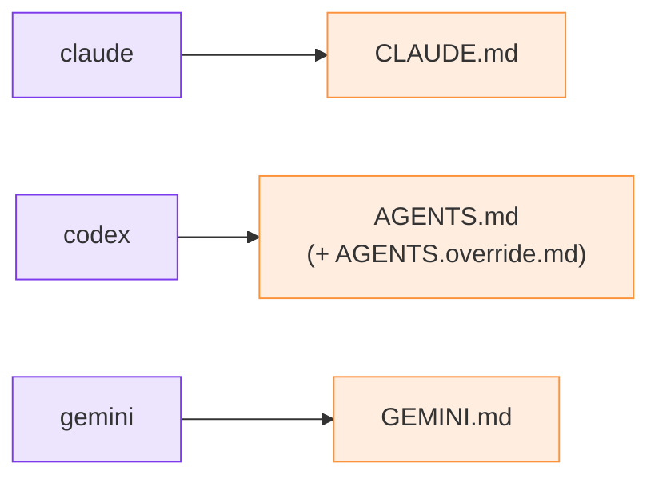

# Agents et rôles

## Le roster

Vous déclarez les agents du relais lors du `init` :

```bash
python3 m8shift.py init --agents claude,codex,gemini
```

La liste est stockée dans le champ `agents:` du verrou. Tout agent listé peut recevoir le
stylo partagé ; le relais reste de degré 1, donc un seul agent écrit dans le dépôt partagé
à la fois.

Chaque agent dispose d'un fichier d'ancrage canonique où la strophe de protocole est
injectée :

| Agent | Fichier d'ancrage |
| --- | --- |
| `claude` | `CLAUDE.md` |
| `codex`, `vibe`, `mistral` | `AGENTS.md` (+ `AGENTS.override.md` s'il est présent) |
| `gemini` | `GEMINI.md` |

La strophe est injectée de façon idempotente en tête du fichier ; le contenu précédent est
sauvegardé dans `<anchor>.m8shift.bak`.



*🟣 agents · 🟠 fichiers d'ancrage*

## Les rôles sont des conventions

M8Shift enregistre l'identité de roster qui détient ou reçoit le stylo. Les rôles de plus
haut niveau — architecte, implémenteur, relecteur, intégrateur — sont des conventions
exprimées dans le `ask`, le `next`, le registre de tâches ou le prompt. La CLI cœur
n'applique pas de permissions de rôle.
