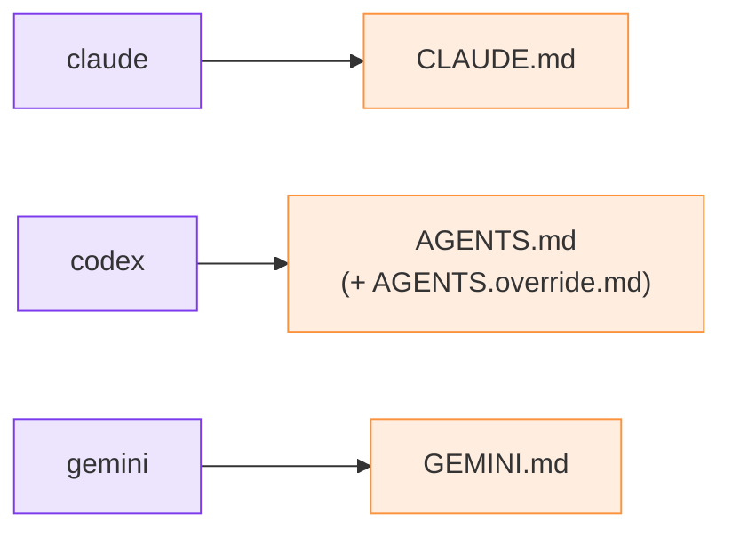

# Agents et rôles

## Le roster (livré)

Vous déclarez les agents du relais lors du `init` :

```bash
python3 m8shift.py init --agents claude,codex
```

La liste est stockée dans le champ `agents:` du verrou. Les **deux premiers** forment la
paire active ; les éventuels suivants sont enregistrés mais inactifs (réservés à un futur
mode N-agents). Le relais est strictement de degré un — deux agents, un stylo, en
alternance.

Chaque agent dispose d'un fichier d'ancrage canonique où la strophe de protocole est
injectée :

| Agent | Fichier d'ancrage |
| --- | --- |
| `claude` | `CLAUDE.md` |
| `codex`, `lechat`, `mistral` | `AGENTS.md` (+ `AGENTS.override.md` s'il est présent) |
| `gemini` | `GEMINI.md` |

La strophe est injectée de façon idempotente en tête du fichier ; le contenu précédent est
sauvegardé dans `<anchor>.cowork.bak`.



*🟣 agents · 🟠 fichiers d'ancrage*

## Rôles (spécifié)

::: tip Spécifié, pas encore livré
Un vocabulaire de **rôles** plus riche — un agent agissant comme architecte, réalisateur,
relecteur ou intégrateur, avec un seul rôle actif par tour — est une direction de la
[roadmap](/fr/roadmap). Dans le relais livré, un agent n'est que son identité de roster ;
« qui fait quoi » s'exprime dans le `ask` du tour, et non dans un champ de rôle formel.
:::
