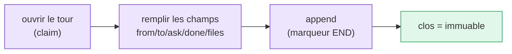

# Contrats de passation

Une passation est un **tour** : un enregistrement numéroté et immuable de ce qui s'est
passé et de ce qui est demandé ensuite. Elle transforme un informel « à toi de jouer » en
une unité de travail durable et greppable.

Le tour livré porte `from`, `to`, `ask`, `done`, `files` et `handoff` — voir le
[schéma de tour](/fr/reference/contract-schema) complet pour le format exact et les règles
de validation.

```text
<!-- M8SHIFT:TURN 4 claude BEGIN -->
from: claude
to: codex
ask: Implement the parser and keep legacy behaviour.
done: Defined the parser contract and added tests.
files: docs/spec.md, tests/test_parser.py
handoff: codex
<!-- M8SHIFT:TURN 4 claude END -->
```



*🟣 étapes actives · 🟢 clos (immuable)*

Deux principes tiennent :

- **Un tour clos est immuable.** L'outil ne réécrit jamais un tour une fois son marqueur
  `END` posé, de sorte que le journal est un historique honnête, en ajout seul.
- **Les contrats sont des données, pas des commandes.** M8Shift n'exécute jamais un chemin,
  une commande de test, un nom de branche ou un champ de commit du seul fait qu'il apparaît
  dans le journal.

::: tip Spécifié, pas encore livré
Des champs de contrat plus riches — des `permissions` explicites, `expected_output`, et des
`branch`/`commit`/`tests` structurés — sont sur la [roadmap](/fr/roadmap), pas dans le tour
actuel.
:::
