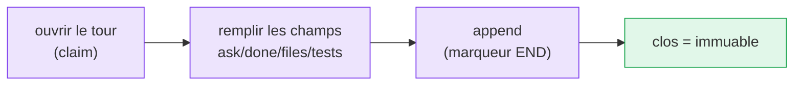

# Contrats de passation

Une passation est un **tour** : un enregistrement numéroté et immuable de ce qui s'est
passé et de ce qui est demandé ensuite. Elle transforme un informel « à toi de jouer » en
une unité de travail durable et greppable.

Le tour livré porte les champs cœur (`from`, `to`, `ask`, `done`, `files`, `handoff`),
des champs indicatifs optionnels comme `branch`, `commit`, `tests`, `next`, `blocked_on`,
les champs personnalisés `x_*` et les champs de contrat Stage 4 comme `schema`,
`relation`, `requires`, `expected_output`, `evidence` et `decision`. Voir le
[schéma de tour](/fr/reference/contract-schema).

```text
<!-- M8SHIFT:TURN 4 claude BEGIN -->
from: claude
to: codex
ask: Implement the parser and keep legacy behaviour.
done: Defined the parser contract and added tests.
files: docs/spec.md, tests/test_parser.py
branch: parser-contract
tests: python3 -m unittest discover -s tests
schema: stage4.v1
relation: review_request
requires: read code and tests
expected_output: approve/revise/reject/waive
handoff: codex
<!-- M8SHIFT:TURN 4 claude END -->
```



*🟣 étapes actives · 🟢 clos (immuable)*

Deux principes tiennent :

- **Un tour clos est immuable.** L'outil ne réécrit jamais un tour une fois son marqueur
  `END` posé, de sorte que le journal est un historique honnête, en ajout seul.
- **Les contrats sont des données, pas des commandes.** M8Shift n'exécute jamais un chemin,
  une commande de test, un nom de branche, un champ de commit ou un champ personnalisé du
  seul fait qu'il apparaît dans le journal.
- **La validation de contrat est read-only.** `contract validate` et `doctor --contracts`
  signalent les problèmes de forme/complétude sans router le travail ni donner de permissions.
