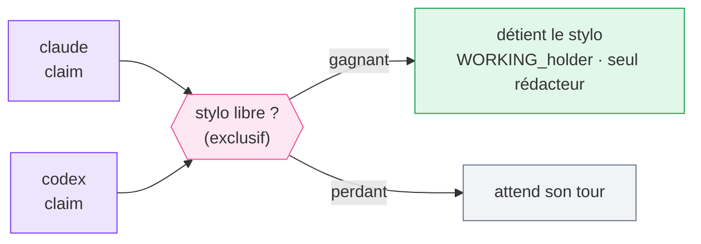

# Le stylo

Le stylo représente la propriété exclusive de l'écriture. Il existe exactement un stylo, et
il protège l'ensemble de l'arbre de travail partagé : à tout moment, au plus un agent le
détient, et seul le détenteur peut modifier le dépôt.

Prendre le stylo, c'est la commande `claim`. Elle est exclusive — si deux agents réclament
en même temps, exactement un l'emporte ; l'autre attend. C'est un mutex coopératif de
**degré un** (un mutex, pas un sémaphore) : alternance stricte, jamais deux rédacteurs.

*🟣 agents · 🩷 le stylo · 🟢 ok · ⚪ attente*

Le stylo est **coopératif et indicatif**. Il prévient les conflits uniquement lorsque les
agents suivent le protocole ; il ne peut pas arrêter un processus qui l'ignore ou qui édite
les fichiers directement.
