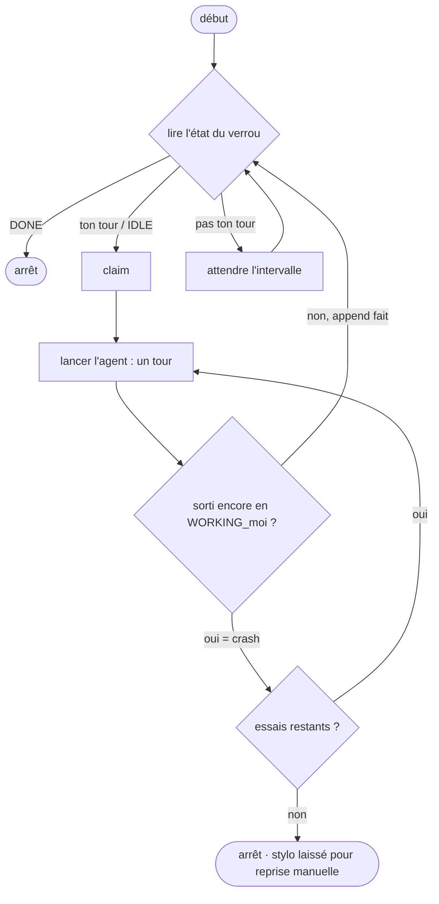

# Exécuter un relais entièrement headless

`m8shift.py` est un coordinateur **passif**. `wait` bloque un *processus* ; il ne peut pas réveiller
une interface d'agent interactive. La seule voie vers un relais sans intervention consiste à piloter
une CLI d'agent **headless** dans une boucle — par exemple `claude -p "<prompt>"` ou
`codex exec "<prompt>"` — où chaque invocation effectue exactement un tour (claim → travail → append).

Le dépôt fournit une boucle de référence, `examples/headless_runner.py`, qui exécute **un** agent.
Lancez une instance par agent headless ; si l'autre côté est une interface interactive, un humain
relance tout de même ce côté.

```bash
examples/headless_runner.py claude \
  --cmd claude -p "Apply M8SHIFT.protocol.md: take your turn (claim, work, append)." \
  --start-on-idle --interval 30 --max-retries 3
```



## Ce qu'une boucle naïve `while wait; do …` rate

Le runner de référence existe parce que la boucle évidente comporte trois bugs :

- **`wait` renvoie `0` à la fois pour « ton tour » et pour `DONE`.** Une boucle naïve relance
  l'agent à l'infini une fois le relais terminé. Le runner lit directement le `state` du verrou.
- **Les deux agents qui démarrent tous deux depuis `IDLE`.** Un unique démarreur désigné
  (`--start-on-idle`) tranche l'égalité.
- **Un tour planté.** Si l'agent quitte alors que le stylo est encore `WORKING_<me>` (il a réclamé
  puis est mort sans `append`), c'est un crash → réessai jusqu'à un plafond, puis arrêt en laissant
  le stylo pour une récupération manuelle. Le runner ne **vole jamais de force** le stylo.

Il utilise également un backoff borné et un `argv` statique (aucune évaluation par le shell de la
commande de l'agent).

## Quand l'utiliser

- Tâches cron, étapes de CI, ou toute automatisation sans surveillance.
- Un relais headless ↔ headless (les deux côtés automatisés).
- Un mélange headless ↔ interactif, où un côté est une CLI et l'autre une interface pilotée par un humain.

Pour les sessions interactives dans l'éditeur, utilisez plutôt le [guide VS Code](./vscode).
