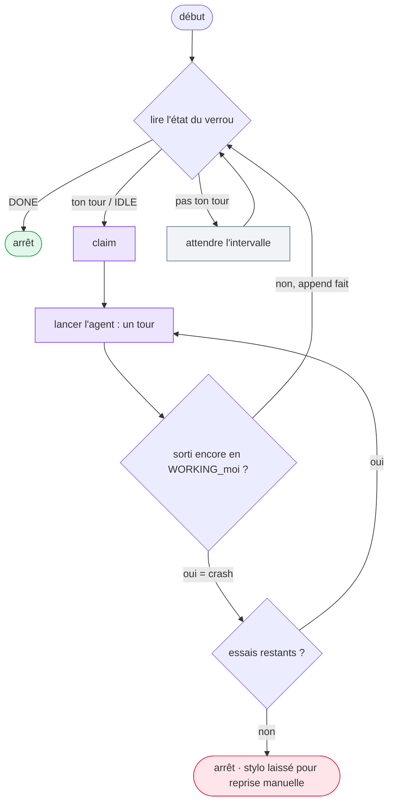

# Exécuter un relais entièrement headless

`m8shift.py` est un coordinateur **passif**. `wait` bloque un *processus* ; il ne peut pas réveiller
une interface d'agent interactive. La seule voie vers un relais sans intervention consiste à piloter
une CLI d'agent **headless** dans une boucle — par exemple `claude -p "<prompt>"` ou
`codex exec "<prompt>"` — où chaque invocation effectue exactement un tour (claim → travail → append).

Les noms de commandes sont des exemples. Utilisez l'équivalent Gemini, Vibe ou une
autre CLI d'agent coopératif tant que chaque invocation effectue exactement un tour
M8Shift.

Le dépôt fournit une boucle de référence, `examples/headless_runner.py`, qui exécute **un** agent.
Lancez une instance par agent headless ; si l'autre côté est une interface interactive, un humain
relance tout de même ce côté.

```bash
examples/headless_runner.py claude \
  --cmd claude -p "Apply M8SHIFT.protocol.md: take your turn (claim, work, append)." \
  --start-on-idle --interval 30 --max-retries 3
```

Pour une automatisation supervisée ou des tests, ajoutez `--once` : le runner exécute un seul
tour éligible puis quitte. Chaque tour lancé reçoit `M8SHIFT_RUN_ID` dans l'environnement enfant
et ajoute des événements de cycle de vie dans `.m8shift/runtime/runs.jsonl`. Si l'agent ajoute
`--field x_run_id=$M8SHIFT_RUN_ID`, l'événement runtime et le tour M8Shift peuvent être corrélés
sans modifier le verrou du cœur.

::: tip Comportement runner durci en v3.26
Le runner de référence écrit aussi un plan de run local immuable, vérifie le `LOCK`
cœur après l'exécution au lieu de croire le statut de sortie du processus, et laisse
la récupération aux règles M8Shift normales. Les événements runtime restent des
sidecars indicatifs.
:::



*🟣 claim & lancer l'agent · ⚪ attente · 🟢 fin → arrêt · 🔴 stylo laissé pour reprise manuelle*

## Ce qu'une boucle naïve `while wait; do …` rate

Le runner de référence existe parce que la boucle évidente comporte trois bugs :

- **`wait` renvoie `0` à la fois pour « ton tour » et pour `DONE`.** Une boucle naïve relance
  l'agent à l'infini une fois le relais terminé. Le runner lit directement le `state` du verrou.
- **Les deux agents qui démarrent tous deux depuis `IDLE`.** Un unique démarreur désigné
  (`--start-on-idle`) tranche l'égalité.
- **Un tour planté.** Si l'agent quitte alors que le stylo est encore `WORKING_<me>` (il a réclamé
  puis est mort sans `append`), c'est un crash → réessai jusqu'à un plafond, puis arrêt en laissant
  le stylo pour une récupération manuelle. Le runner ne **vole jamais de force** le stylo.
- **Un tour long.** Si un seul tour peut dépasser le TTL de 30 minutes, le wrapper doit relancer
  périodiquement `python3 m8shift.py claim <me>` pour rafraîchir `expires` — un **heartbeat
  manuel** ; M8Shift ne rafraîchit jamais le verrou à ta place.
- **Pas d'identifiant runtime auditable.** Le runner émet `M8SHIFT_RUN_ID` et `runs.jsonl` pour
  corréler un processus lancé avec le tour finalement ajouté par l'agent.
- **Dérive du plan mutable.** Le runner enregistre un plan de run avant lancement pour que les
  rapports puissent comparer l'intention et ce qui s'est passé.
- **Confusion sur le statut de sortie.** Le runner lit le `LOCK` après la sortie de l'enfant ; un
  code de sortie zéro ne prouve pas que le relais a avancé.

Il utilise également un backoff borné et un `argv` statique (aucune évaluation par le shell de la
commande de l'agent).

## Quand l'utiliser

- Tâches cron, étapes de CI, ou toute automatisation sans surveillance.
- Un relais headless ↔ headless (les deux côtés automatisés).
- Un mélange headless ↔ interactif, où un côté est une CLI et l'autre une interface pilotée par un humain.

Pour les sessions interactives dans l'éditeur, utilisez plutôt le [guide VS Code](./vscode).
