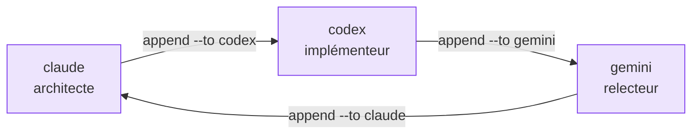

# Flux de travail multi-agents

M8Shift accepte maintenant un roster configurable avec plus de deux agents, tout en
gardant un seul stylo partagé. La distinction importante est celle-ci :

- **livré :** N agents peuvent être déclarés dans `--agents`, et un tour peut passer la
  main à n'importe quel autre membre du roster ;
- **toujours degré 1 :** un seul agent écrit dans le dépôt partagé à la fois ;
- **travail parallèle de fonctionnalités :** utilisez `m8shift-worktree.py`, qui crée
  des worktrees git isolés et sérialise l'intégration via un stylo d'intégration.

```bash
python3 m8shift.py init --agents claude,codex,gemini
python3 m8shift.py next claude
python3 m8shift.py append claude --to codex --ask "Implémente le parser." --done "Contrat spécifié."
python3 m8shift.py next codex
python3 m8shift.py append codex --to gemini --ask "Relis l'implémentation." --done "Parser implémenté."
```



*🟣 roster N agents · un stylo partagé*

## Les rôles sont des conventions

La CLI cœur enregistre les passations, demandes, résumés, fichiers, branches, commits,
tests et champs personnalisés. Elle n'applique pas de permissions de rôle ni de graphe
de dépendances. Si vous voulez une séparation architecte/relecteur/intégrateur, écrivez
ce contrat dans `--ask`, `--next`, le registre de tâches ou le prompt de protocole.

## Quand vous avez besoin de vrai parallélisme

Utilisez le compagnon worktree pour des branches isolées :

```bash
python3 m8shift-worktree.py claim feature-parser codex --base main
python3 m8shift-worktree.py status
python3 m8shift-worktree.py integrate feature-parser claude --into main --to codex
```

Le compagnon isole le travail de fonctionnalité et sérialise quand même l'étape de
merge/intégration. Il ne transforme pas un même répertoire partagé en espace multi-écrivain sûr.
