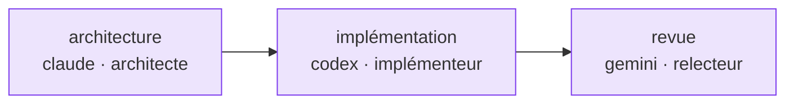

# Flux de travail multi-agents

::: warning Spécifié, pas encore livré
M8Shift livre un relais **à deux agents** strict (un couple configurable, degré 1). Le flux de travail
basé sur les rôles et les dépendances ci-dessous est une direction **spécifiée** pour plus de deux
agents simultanés — c'est un futur RFC, pas une fonctionnalité exécutable aujourd'hui. Voir la
[roadmap](/fr/roadmap).
:::

Un flux de travail multi-agents attribue des rôles et des dépendances sans nécessiter de hiérarchie
de gestion permanente.

```yaml
workflow:
  coordinator: { agent: claude, role: coordinator }
  tasks:
    - id: architecture
      target: { agent: claude, role: architect }
    - id: implementation
      depends_on: { all: [architecture] }
      target: { agent: codex, role: implementer }
    - id: review
      depends_on: { all: [implementation] }
      target: { agent: gemini, role: reviewer }
```

Cette déclaration est un graphe de dépendances : chaque tâche attend ses prérequis avant que son agent cible la prenne.



Le coordinateur est un rôle utilisé pour une seule phase. Le même agent peut devenir plus tard
l'intégrateur, mais ne devrait pas approuver son propre travail produit lorsqu'une validation
indépendante est requise.
