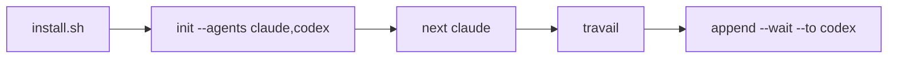

# Démarrage rapide

::: tip Statut
Les commandes ci-dessous correspondent au relais de degré 1 livré : un stylo partagé,
n'importe quel membre du roster configuré, un seul rédacteur à la fois. Utilisez le
compagnon worktree seulement pour du travail de fonctionnalité parallèle et isolé.
:::

::: tip Nommage
La CLI est `m8shift.py` ; les fichiers de projet utilisent `M8SHIFT.md` et `.m8shift.lock`.
:::

::: tip Noms d'agents dans les exemples
`claude` et `codex` sont des placeholders du roster par défaut. Utilisez `gemini`,
`vibe` ou tout autre nom d'agent coopératif si cet agent peut lire son ancrage,
lancer la CLI et respecter `claim → travail → append`.
:::



*🟣 mise en place → première passation*

Installez M8Shift dans un projet :

```bash
cd /path/to/project
curl -fsSL https://raw.githubusercontent.com/M8Shift/M8Shift/main/install.sh | bash -s -- --verify --agents claude,codex
```

L'installateur télécharge `m8shift.py` et la boîte à outils `m8shift-worktree.py`
dans le répertoire courant, les vérifie avec `checksums.sha256`, puis lance `init`.
Il n'utilise pas `sudo`, ne modifie pas votre PATH global et ne démarre aucun
service d'arrière-plan.

Pour une release épinglée, téléchargez l'installateur depuis le tag et passez la même ref :

```bash
curl -fsSL https://raw.githubusercontent.com/M8Shift/M8Shift/vX.Y.Z/install.sh | \
  bash -s -- --ref vX.Y.Z --verify --agents claude,codex
```

Vous préférez l'adoption manuelle ? Copiez `m8shift.py` dans le projet, puis lancez
`python3 m8shift.py init --agents claude,codex`.

Vérifiez l'état :

```bash
python3 m8shift.py status --for claude
```

Réclamez le stylo avant de travailler. Dans une boucle agent réelle, préférez
`next` : il attend si besoin, effectue le `claim` normal, puis affiche la dernière
passation.

```bash
python3 m8shift.py next claude
```

Clôturez le tour et passez la main :

```bash
python3 m8shift.py append claude --to codex \
  --done "Defined the parser contract and added tests." \
  --ask "Implement the parser and preserve legacy behavior." \
  --files "docs/spec.md,tests/test_parser.py" \
  --wait
```

L'agent suivant exécute alors :

```bash
python3 m8shift.py next codex
```

Avant d'arrêter un panneau ou une boucle d'automatisation, lancez
`status --for <agent>`. Si le relais n'est pas `DONE`, l'action sûre est de continuer
à attendre, claim, append, release, ou clôturer explicitement.

## Règle d'or

> Ne modifiez jamais le dépôt partagé avant un claim réussi.
