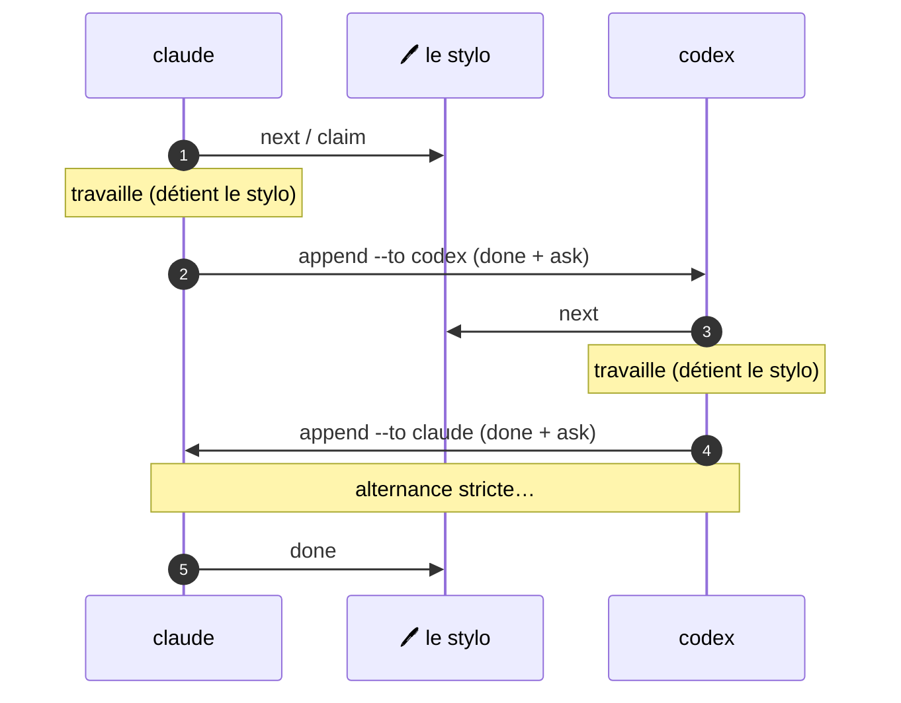

# Relais à deux agents

Le flux de travail M8Shift le plus simple utilise deux agents et un stylo global.
Il est délibérément séquentiel : sa valeur n'est pas le débit, mais une propriété prévisible et une
trace de passation durable.

Cette page utilise `claude` et `codex` comme noms d'exemple concrets. La même boucle
à deux agents fonctionne avec `gemini`, `vibe` ou tout couple d'agents coopératifs
capable de lancer les commandes du relais et de respecter la passation.



*🟣 agents · 🩷 le stylo*

## La boucle complète

À configurer une fois :

```bash
cp m8shift.py /path/to/project/
cd /path/to/project
python3 m8shift.py init --agents claude,codex
```

Chaque agent répète le même cycle. Premier tour de Claude :

```bash
python3 m8shift.py next claude         # attend si besoin, puis claim
# … edit files, run tests …
python3 m8shift.py append claude --to codex \
  --done "Added the parser contract and tests." \
  --ask "Implement the parser; keep legacy behaviour." \
  --files "docs/spec.md,tests/test_parser.py" \
  --wait
```

Codex prend ensuite le relais :

```bash
python3 m8shift.py next codex
# … work …
python3 m8shift.py append codex --to claude --done "…" --ask "…" --wait
```

Une fois le travail terminé, l'agent qui détient le stylo clôt le relais :

```bash
python3 m8shift.py done codex
```

## Règle d'or

> Ne modifiez jamais le dépôt partagé avant un `claim` réussi.

Cet unique invariant est ce qui rend le relais sûr. Consultez le [stylo](/fr/concepts/pen) et le
[modèle d'états](/fr/reference/state-model) pour comprendre ce qui se passe sous le capot.
