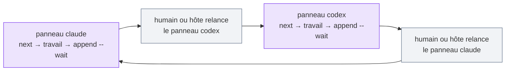

# Utiliser M8Shift dans VS Code

M8Shift peut coordonner Claude et Codex exécutés sous forme de panneaux à l'intérieur de VS Code — les
panneaux *sont* les agents. La seule chose à bien intégrer : une interface de conversation interactive
n'est **pas** un processus en arrière-plan. `wait` bloque un shell ; il ne peut pas réveiller une
conversation endormie. Un humain (ou une intégration hôte) relance l'agent suivant après chaque passation.

Claude et Codex sont ici le couple d'UI concret. La même discipline fonctionne avec
Gemini, Vibe ou toute autre UI d'agent coopératif capable de lire les instructions
du projet, lancer des commandes shell et respecter `claim → travail → append`.



*🟣 panneaux d'agents · ⚪ reprise humaine (`wait` ne peut pas réveiller une UI)*

## Mise en place

1. Ouvrez le dépôt dans VS Code **à sa racine** — une fenêtre par dépôt.
2. Ajoutez la CLI et initialisez :

   ```bash
   cp m8shift.py .
   python3 m8shift.py init --agents claude,codex
   ```

3. Exécutez **Developer: Reload Window**, puis démarrez de **nouvelles** conversations afin que chaque
   agent récupère son fichier d'ancrage fraîchement injecté (`CLAUDE.md`, `AGENTS.md`).
4. Ouvrez les deux panneaux dans la même fenêtre. Pour l'autonomie, mettez Codex en **Agent mode** et
   Claude en **auto-accept**.

## Amorçage de la boucle

Donnez à chaque agent une courte invite de boucle, Claude en premier :

> Exécute `python3 m8shift.py next claude`. Si tu prends le stylo, fais exactement
> une étape bornée, puis `append claude --to codex --wait` avec un `--ask` clair.
> Avant toute réponse finale à l'humain, lance `python3 m8shift.py status --for claude` ;
> si le relais n'est pas `DONE`, continue avec l'action sûre indiquée.

Puis Codex, de manière symétrique (`next codex`, `append codex --to claude --wait`,
`status --for codex`).

## Maintenir le mouvement

- Après chaque passation, **relancez le panneau cible** : « Reprends la boucle M8Shift à partir de
  `python3 m8shift.py next <agent>`. »
- Préférez `append --wait` lorsqu'un agent passe la main : le processus reste bloqué
  jusqu'à son prochain tour ou `DONE`, ce qui réduit les sorties prématurées.
- Gardez `M8SHIFT.md` ouvert à côté de la source — le bloc de verrou indique à qui est le tour.
- Utilisez `python3 m8shift.py status --for <agent>` lorsqu'un humain interrompt un
  panneau ; la commande imprime l'action sûre au lieu de dépendre de la mémoire.
- Pendant un **long** `WORKING_<vous>`, relancez `python3 m8shift.py claim <vous>` pour remettre
  `expires` à `now + 30 min` — un **heartbeat manuel** (l'agent ou un wrapper headless le fait ;
  M8Shift ne tourne aucun daemon). Sans ça, le verrou se périme au bout de 30 minutes et un autre
  agent peut le réclamer.
- Si un panneau a planté en plein tour et a laissé un verrou périmé, récupérez avec
  `python3 m8shift.py claim <agent> --force` (ne fonctionne qu'une fois le verrou au-delà de son
  TTL de 30 minutes).

Pour des exécutions sans surveillance, utilisez le [runner headless](./headless) plutôt que l'IDE.
M8Shift reste la primitive de coordination — il ne fait pas passer en douce un démon sous un nom
à la mode.
