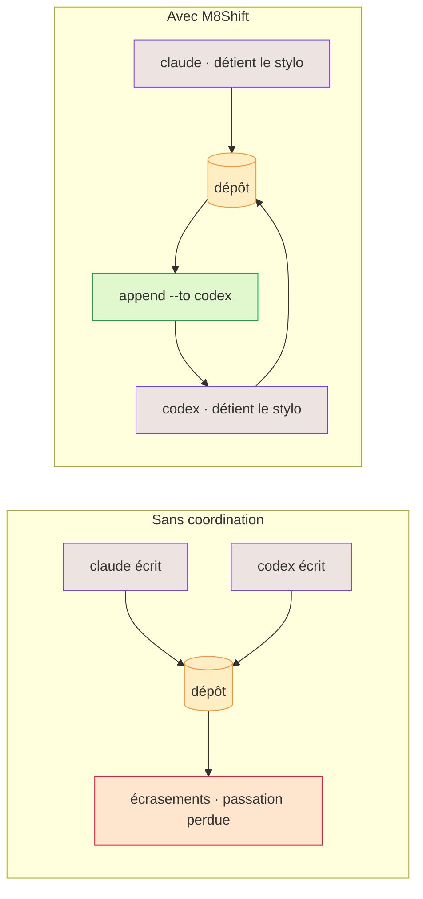

# Pourquoi M8Shift ?

Les agents IA sont efficaces individuellement, mais le travail partagé sur un dépôt crée des
modes de défaillance prévisibles :

- les modifications concurrentes s'écrasent ou s'invalident mutuellement ;
- un agent ne peut pas savoir si un autre est encore en train de travailler ;
- les passations perdent le contexte d'une session à l'autre ;
- les producteurs approuvent leur propre travail ;
- les tâches « parallèles » partagent discrètement les mêmes fichiers ;
- les commits et les résultats de tests sont décrits avec plus d'assurance qu'ils ne se sont déroulés.

M8Shift répond directement aux trois premiers points aujourd'hui : une propriété explicite et
exclusive (le stylo), un journal des tours immuable et une règle « réclamer avant d'écrire ». Des
réponses plus riches au reste — contrats structurés, tâches sensibles aux dépendances et validation
indépendante — constituent une direction spécifiée de la [roadmap](/fr/roadmap), pas encore livrée.

*🟣 agents · 🟠 dépôt · 🔴 écrasements · 🟢 passation*

## Ce que ce n'est pas

M8Shift n'est ni un fournisseur de modèles, ni une passerelle hébergée, ni une plateforme de mémoire,
ni un runtime d'agents universel. Les runtimes et passerelles d'agents complets gèrent les sessions,
les canaux, les outils, les fournisseurs, la mémoire et le routage. M8Shift se concentre sur la
coordination au niveau du dépôt et peut compléter un tel runtime plutôt que de l'imiter.
