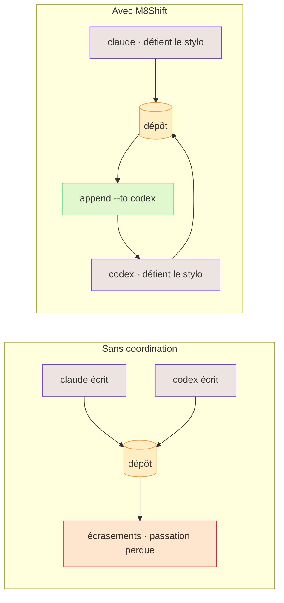

# Pourquoi M8Shift ?

Les agents IA sont efficaces individuellement, mais le travail partagé sur un dépôt crée des
modes de défaillance prévisibles :

- les modifications concurrentes s'écrasent ou s'invalident mutuellement ;
- un agent ne peut pas savoir si un autre est encore en train de travailler ;
- les passations perdent le contexte d'une session à l'autre ;
- les producteurs approuvent leur propre travail ;
- les tâches « parallèles » partagent discrètement les mêmes fichiers ;
- les commits et les résultats de tests sont décrits avec plus d'assurance qu'ils ne se sont déroulés.

M8Shift répond pragmatiquement à ces points aujourd'hui : propriété exclusive explicite
(le stylo), journal de tours immuable, règle « réclamer avant d'écrire », champs
indicatifs structurés, mémoire, tâches, historique de sessions, garde-fous de boucle et
[compagnon worktree optionnel](./worktree-toolbox) pour du travail parallèle isolé. Ce
qu'il ne fait toujours pas : imposer un runtime hébergé ou un ordonnanceur complet de
dépendances.

*🟣 agents · 🟠 dépôt · 🔴 écrasements · 🟢 passation*

## Des agents différents, par choix

L'idée n'est pas de rendre les agents interchangeables — c'est de faire travailler ensemble des
agents *différents*. Claude, Codex, Gemini, Vibe et d'autres ont des forces différentes, des avis
différents, et leurs compétences évoluent. Quand ils relisent le même travail — technique,
rédactionnel, juridique, design —, **le désaccord entre eux est utile** : un second agent rattrape
ce que le premier a manqué, et la contradiction fait apparaître un vrai choix au lieu de le masquer.

M8Shift garde un humain dans la boucle. Les agents se passent la main et transmettent le contexte ;
**la décision finale reste humaine**. Et comme la coordination vit dans un seul fichier partagé à la
racine du dépôt, on arrête de **copier-coller entre des UI de chat cloisonnées** pour garder les
agents synchronisés — ils relaient via le dépôt, comme des coéquipiers qui travaillent par
roulements, pas des rivaux qui s'écrasent.

## Ce que ce n'est pas

M8Shift n'est ni un fournisseur de modèles, ni une passerelle hébergée, ni une plateforme de mémoire,
ni un runtime d'agents universel. Les runtimes et passerelles d'agents complets gèrent les sessions,
les canaux, les outils, les fournisseurs, la mémoire et le routage. M8Shift se concentre sur la
coordination au niveau du dépôt et peut compléter un tel runtime plutôt que de l'imiter.
