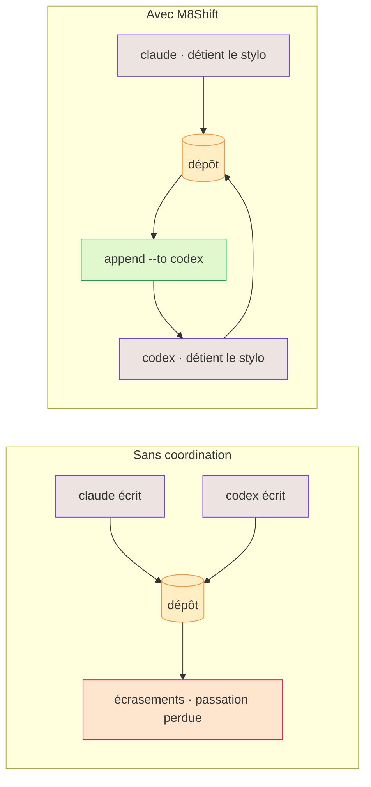

# Pourquoi M8Shift ?

Les agents IA sont efficaces individuellement, mais le travail partagé sur un dépôt crée des
modes de défaillance prévisibles :

- les modifications concurrentes s'écrasent ou s'invalident mutuellement ;
- un agent ne peut pas savoir si un autre est encore en train de travailler ;
- les passations perdent le contexte d'une session à l'autre ;
- les producteurs approuvent leur propre travail ;
- les tâches « parallèles » partagent discrètement les mêmes fichiers ;
- les commits et les résultats de tests sont décrits avec plus d'assurance qu'ils ne se sont déroulés.

M8Shift répond pragmatiquement à ces points aujourd'hui : propriété exclusive explicite
(le stylo), journal de tours immuable, règle « réclamer avant d'écrire », champs
indicatifs structurés, mémoire, tâches, historique de sessions, garde-fous de boucle et
[compagnon worktree optionnel](./worktree-toolbox) pour du travail parallèle isolé. Ce
qu'il ne fait toujours pas : imposer un runtime hébergé ou un ordonnanceur complet de
dépendances.

*🟣 agents · 🟠 dépôt · 🔴 écrasements · 🟢 passation*

## Pourquoi le multi-agent aide

Un assistant unique est utile pour une tâche à la taille d'un prompt : expliquer,
résumer, brouillonner ou faire une modification ciblée. Un travail long est différent.
Il contient de la planification, de l'implémentation, de la revue, des corrections, de
la documentation et un arbitrage final. Quand un seul agent tente de tout porter, l'humain
devient souvent le chef de projet caché : il relance, recopie le contexte, vérifie les
affirmations et assemble des sorties partielles.

Le multi-agent devient utile quand les rôles restent explicites :

  <a class="m8-doc-card" href="/fr/use-cases#construire-du-logiciel">
    <i class="fa-solid fa-list-check" aria-hidden="true"></i>
    <strong>Les tâches longues ont besoin de structure</strong>
    Planifier, prioriser, coder, tester, documenter et publier sont des responsabilités différentes. Les séparer rend le flux plus inspectable.
  </a>
  <a class="m8-doc-card" href="/fr/concepts/agents-roles">
    <i class="fa-solid fa-user-gear" aria-hidden="true"></i>
    <strong>Les rôles spécialisés réduisent le flou</strong>
    Un planificateur, implémenteur, relecteur, éditeur ou testeur peut optimiser une mission au lieu de produire une réponse générale.
  </a>
  <a class="m8-doc-card" href="/fr/concepts/handoff-contracts">
    <i class="fa-solid fa-people-arrows" aria-hidden="true"></i>
    <strong>Les passations gardent le contexte</strong>
    Chaque tour doit dire ce qui a changé, quelles preuves existent et ce que le prochain agent doit faire.
  </a>
  <a class="m8-doc-card" href="/fr/concepts/validation">
    <i class="fa-solid fa-check-double" aria-hidden="true"></i>
    <strong>La revue est un rôle séparé</strong>
    L'agent qui produit le travail ne devrait pas être le seul à le valider. Un second passage rattrape les exigences oubliées et les hypothèses fragiles.
  </a>

La contrepartie existe : plus d'agents peut signifier plus de coût, plus de discussions
et plus de risques de malentendus. La réponse de M8Shift reste volontairement étroite :
il ne cherche pas à être le runtime qui lance ou raisonne pour chaque agent. Il donne au
dépôt partagé un protocole de tour de rôle, un journal et une trace lisible afin que le
workflow multi-agent reste relisible.

::: tip Lecture complémentaire
L'article Liora <a href="https://liora.io/crew-ai-tout-savoir" target="_blank" rel="noopener noreferrer">Crew AI : le framework qui transforme les IA en collègues de bureau</a> résume bien le motif général : les assistants isolés sont forts sur les tâches ponctuelles, tandis que les projets complexes gagnent avec des rôles, de la coordination, du contexte partagé et un arbitrage humain.
:::

## Des agents différents, par choix

L'idée n'est pas de rendre les agents interchangeables — c'est de faire travailler ensemble des
agents *différents*. Claude, Codex, Gemini, Vibe et d'autres ont des forces différentes, des avis
différents, et leurs compétences évoluent. Quand ils relisent le même travail — technique,
rédactionnel, juridique, design —, **le désaccord entre eux est utile** : un second agent rattrape
ce que le premier a manqué, et la contradiction fait apparaître un vrai choix au lieu de le masquer.

M8Shift garde un humain dans la boucle. Les agents se passent la main et transmettent le contexte ;
**la décision finale reste humaine**. Et comme la coordination vit dans un seul fichier partagé à la
racine du dépôt, on arrête de **copier-coller entre des UI de chat cloisonnées** pour garder les
agents synchronisés — ils relaient via le dépôt, comme des coéquipiers qui travaillent par
roulements, pas des rivaux qui s'écrasent.

## <i class="fa-solid fa-seedling m8-heading-icon" aria-hidden="true"></i> Preuve vivante de cette session

::: tip M8Shift construit avec M8Shift
Ce site ne décrit pas un workflow hypothétique depuis l'extérieur. Le train de release actuel est coordonné par M8Shift lui-même : les agents utilisent le relais pour implémenter, contredire, relire, fusionner et passer le travail suivant pendant que le shift reste vivant.
:::

Le vrai gain n'est pas seulement la vitesse ; c'est la vitesse avec une trace auditable. Dans cette session, la relecture contradictoire a permis au projet de continuer à livrer tout en gardant le contexte entre les tours et une trace lisible de qui a demandé quoi, de ce qui a changé et des preuves produites.

| Observation issue de cette session | Ce que cela montre |
|------------------------------------|--------------------|
| ~7 h de travail | Estimation mainteneur pour une séquence dense d'implémentation, revue, release, documentation et déploiement. |
| ~44 tours de relais | Les échanges vont de quelques minutes à environ 45 minutes, avec des retours de revue complexes et des attentes utilisateur. |
| 6 incréments de version livrés à la volée (`v3.21` → `v3.26`) | Le relais a continué à coordonner pendant que l'outil évoluait sous lui, sans casser le shift en cours. |
| Shift encore en cours et stable au moment de publier | La preuve est opérationnelle : la même boucle de coordination qui a produit la fonctionnalité porte déjà la passation suivante. |

::: warning Observation illustrative, pas benchmark
Ces chiffres sont des observations de session, pas un benchmark contrôlé. Ils dépendent du périmètre projet, de la qualité des agents, de l'attention du mainteneur, du contexte déjà disponible et du niveau de revue requis. Le statut honnête reste late-alpha : M8Shift est assez utile pour se construire et se déployer lui-même, mais le durcissement continue.
:::

Pour le cadrage économique plus large, voir la section roadmap [preuve par construction et ROI](/fr/roadmap#prouve-en-se-construisant-lui-meme).

## Ce que ce n'est pas

M8Shift n'est ni un fournisseur de modèles, ni une passerelle hébergée, ni une plateforme de mémoire,
ni un runtime d'agents universel. Les runtimes et passerelles d'agents complets gèrent les sessions,
les canaux, les outils, les fournisseurs, la mémoire et le routage. M8Shift se concentre sur la
coordination au niveau du dépôt et peut compléter un tel runtime plutôt que de l'imiter.
