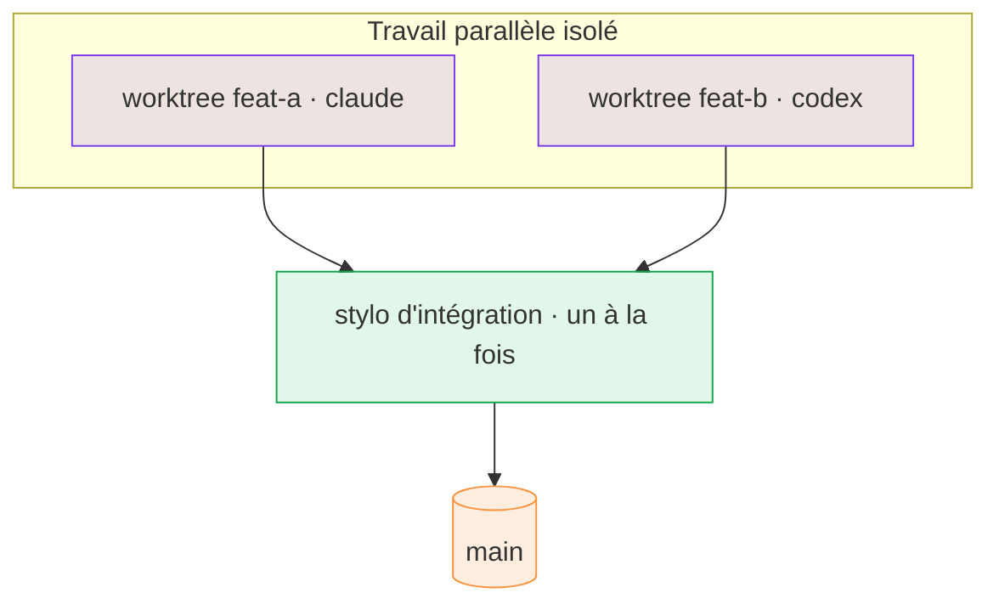

# Boîte à outils worktree

Le cœur de M8Shift est un **stylo degré 1** : les agents écrivent à tour de rôle dans **un seul
working tree partagé**, un à la fois. Quand tu veux du **vrai parallèle isolé** — plusieurs agents
qui construisent des fonctionnalités différentes en même temps — ajoute le compagnon optionnel
**`m8shift-worktree.py`**. Il donne à chaque tâche son propre worktree git et **sérialise les
merges** via un unique stylo d'intégration : deux intégrations ne tournent jamais en même temps.



*🟣 worktrees isolés · 🟢 un stylo d'intégration sérialisé · 🟠 branche cible*

## Installation — installateur d'abord, `init` ensuite

L'installateur en une ligne télécharge `m8shift.py` et `m8shift-worktree.py`, les
vérifie avec `checksums.sha256`, puis lance `init` :

```bash
cd /mon/projet
curl -fsSL https://raw.githubusercontent.com/M8Shift/M8Shift/main/install.sh | bash -s -- --verify --agents claude,codex
```

`python3 m8shift.py init` génère le relais (`M8SHIFT.md`, le protocole, les ancres),
mais il ne copie **pas** les scripts tout seul. Pour une adoption manuelle, copie
**les deux** fichiers dans ton projet (ou garde-les dans ton `PATH`) :

```bash
cp m8shift.py m8shift-worktree.py /mon/projet/   # le cœur + la boîte à outils
cd /mon/projet
python3 m8shift.py init                           # configuration relais ponctuelle (cœur seul)
```

`m8shift-worktree.py` importe le cœur : les deux fichiers vivent côte à côte.

## Ce qu'il fait (et ne fait pas)

- **Il fait :** un worktree git isolé par tâche (`.m8shift/worktrees/<id>`), une intégration
  **sérialisée et résistante aux crashs** qui fusionne une fonctionnalité à la fois derrière le
  stylo canonique, et une passation propre à l'agent suivant.
- **Il ne fait pas :** ce n'est **pas** un auto-merge opaque, il ne supprime **jamais** un worktree
  automatiquement (tu confirmes avec `--yes`), et il ne tourne **aucun daemon**. L'intégration est un
  `git merge --no-ff --no-commit` explicite, vérifié avant d'être commité, et chaque chemin passe la
  main — il ne laisse jamais un demi-merge en plan.

## Commandes

```bash
# démarrer un worktree de fonctionnalité isolé depuis une branche de base
python3 m8shift-worktree.py claim <id> <agent> --base <branche> [--branch <nom>]

# noter la tâche faite (une simple ligne de registre ; la vraie passation, c'est `integrate`)
python3 m8shift-worktree.py done <id> <agent>

# merge sérialisé dans une branche, puis passe le stylo à l'agent suivant
python3 m8shift-worktree.py integrate <id> <agent> --into <branche> --to <agent-suivant>

# retirer un worktree de fonctionnalité (jamais automatique)
python3 m8shift-worktree.py drop <id> <agent> --yes

# le LOCK canonique + les worktrees du compagnon
python3 m8shift-worktree.py status [<id>]
```

Un court exemple :

```bash
python3 m8shift-worktree.py claim feat-parser codex --base main
# …codex travaille dans .m8shift/worktrees/feat-parser, y commite…
python3 m8shift-worktree.py integrate feat-parser claude --into main --to codex
python3 m8shift-worktree.py status
```

::: tip La branche cible doit être libre
Git interdit la même branche dans deux worktrees : la branche que tu passes en `--into` ne doit pas
être checked-out dans ton checkout principal. Garde la racine canonique **détachée** (ou sur une
branche de coordination) pour que des cibles comme `main` restent libres pour le worktree
d'intégration dédié.
:::
