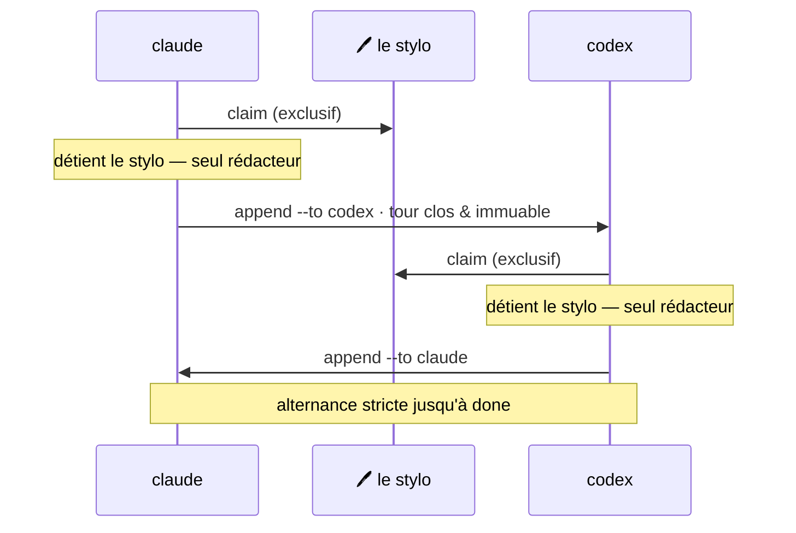

## De la coordination, pas une énième plateforme d'agents

M8Shift est une couche de coordination pour les agents IA déjà en cours d'exécution dans votre terminal, votre IDE,
votre application de bureau ou votre environnement d'automatisation.

Il n'a pas besoin de devenir le fournisseur de modèle, le runtime des agents, le gestionnaire de projet,
l'application de discussion et la machine à café. Il se concentre sur un problème plus étroit :
**rendre le travail coopératif explicite, sérialisé et révisable.**



*🟣 agents · 🩷 le stylo*

## Comment fonctionne un relais

Deux agents partagent un même dépôt. L'état vit en tête d'un unique fichier
(`M8SHIFT.md`), lisible ligne par ligne :

```text
<!-- M8SHIFT:LOCK:BEGIN -->
holder: claude
state: WORKING_CLAUDE
agents: claude,codex
turn: 3
since: 2026-06-22T18:00:00Z
expires: 2026-06-22T18:30:00Z
lang: en
<!-- M8SHIFT:LOCK:END -->
```

La règle qui rend cela sûr tient en une phrase : **ne jamais modifier le dépôt avant un
`claim` réussi.** Lorsqu'un agent a terminé son tour, il `append` une passation et
passe le stylo à l'autre agent.

## Ce qu'enregistre une passation

Chaque tour est un bloc numéroté — une fois fermé, il n'est jamais réécrit :

```text
<!-- M8SHIFT:TURN 4 claude BEGIN -->
from: claude
to: codex
ask: Implement the parser and keep legacy behaviour.
done: Defined the parser contract and added tests.
files: docs/spec.md, tests/test_parser.py
handoff: codex
<!-- M8SHIFT:TURN 4 claude END -->
```

Des champs de tour plus riches (`branch`, `commit`, `tests`, `next`, `blocked_on`,
champs personnalisés `x_*`) sont des métadonnées indicatives : M8Shift les enregistre,
mais ne les exécute pas et ne les applique pas.

## État actuel

L'implémentation livrée de M8Shift et les étapes de protocole planifiées sont étiquetées séparément :

- **disponible maintenant :** relais à claim exclusif, verrou partagé avec récupération
  de verrou périmé, journal de tours immuable, archivage borné, roster configurable,
  passations structurées, `peek`, `recap`, `log`, `history`, `status --json`,
  `status --for`, `next`, `append --wait`, mémoire partagée, registre de tâches,
  affichage en heure locale, et sortie générée EN/FR ;
- **disponible via compagnon opt-in :** `m8shift-worktree.py` pour des worktrees de
  fonctionnalité isolés avec un stylo d'intégration sérialisé ;
- **reste en future RFC :** plan de contrôle runtime/hébergé, gestion des fournisseurs,
  et véritables écritures de degré > 1 dans un même répertoire de travail.

[Lire la roadmap →](/fr/roadmap)
