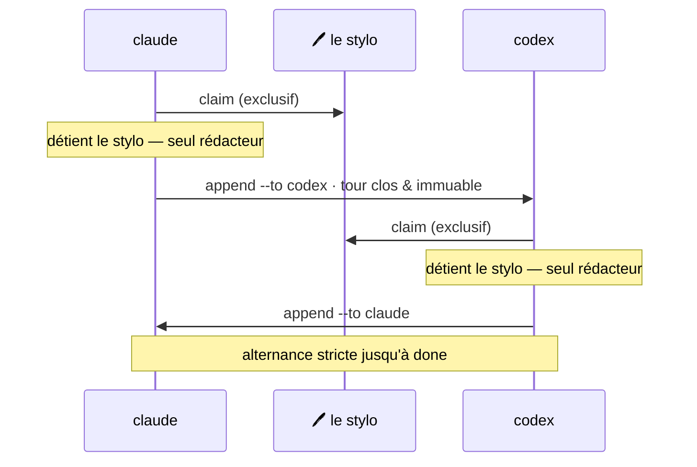

## De la coordination, pas une énième plateforme d'agents

M8Shift est une couche de coordination pour les agents IA déjà en cours d'exécution dans votre terminal, votre IDE,
votre application de bureau ou votre environnement d'automatisation.

Il n'a pas besoin de devenir le fournisseur de modèle, le runtime des agents, le gestionnaire de projet,
l'application de discussion et la machine à café. Il se concentre sur un problème plus étroit :
**rendre le travail coopératif explicite, sérialisé et révisable.**



## Comment fonctionne un relais

Deux agents partagent un même dépôt. L'état vit en tête d'un unique fichier
(`M8SHIFT.md`, ou `COWORK.md` sur les projets existants), lisible ligne par ligne :

```text
<!-- M8SHIFT:LOCK:BEGIN -->
holder: claude
state: WORKING_CLAUDE
agents: claude,codex
turn: 3
since: 2026-06-22T18:00:00Z
expires: 2026-06-22T18:30:00Z
lang: en
<!-- M8SHIFT:LOCK:END -->
```

La règle qui rend cela sûr tient en une phrase : **ne jamais modifier le dépôt avant un
`claim` réussi.** Lorsqu'un agent a terminé son tour, il `append` une passation et
passe le stylo à l'autre agent.

## Ce qu'enregistre une passation

Chaque tour est un bloc numéroté — une fois fermé, il n'est jamais réécrit :

```text
<!-- M8SHIFT:TURN 4 claude BEGIN -->
from: claude
to: codex
ask: Implement the parser and keep legacy behaviour.
done: Defined the parser contract and added tests.
files: docs/spec.md, tests/test_parser.py
handoff: codex
<!-- M8SHIFT:TURN 4 claude END -->
```

Des champs de tour plus riches (branch, commit, tests, next) sont **spécifiés, pas encore livrés** —
voir la [roadmap](/fr/roadmap).

## État actuel

M8Shift évolue à partir de la conception originelle du relais CoWork. L'implémentation livrée et
les étapes de protocole planifiées sont étiquetées séparément :

- **disponible maintenant :** le relais à claim exclusif, le verrou partagé avec récupération de verrou périmé, le
  journal de tours immuable, l'archivage borné, le couple d'agents configurable (roster), une
  CLI locale mono-fichier, et la sortie EN/FR ;
- **spécifié pour la suite :** la mémoire partagée et le récapitulatif, les champs de tour structurés avec `peek`,
  et une chronologie / un statut JSON ;
- **future RFC :** plus de deux agents simultanés (degré > 1).

[Lire la roadmap →](/fr/roadmap)
