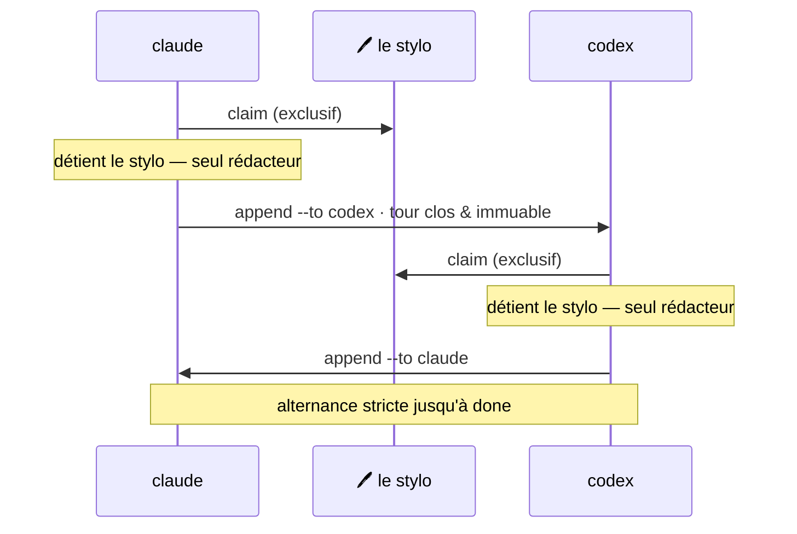

## Démarrage rapide

<div class="m8-quickstart">
  <div class="m8-quickstart__bar">
    <div class="m8-quickstart__lights" aria-hidden="true">
      <span></span><span></span><span></span>
    </div>
    <div class="m8-quickstart__tabs">
      <span class="is-active">One-liner</span>
      <span>macOS &amp; Linux</span>
      <span>Windows</span>
    </div>
    <div class="m8-quickstart__badge">install local</div>
  </div>
  <div class="m8-quickstart__body">
    <p class="m8-quickstart__comment"><i class="fa-solid fa-shield-halved" aria-hidden="true"></i> Vérifie la CLI + la boîte à outils worktree, les installe localement, puis lance init.</p>
    <pre><code><span class="m8-prompt">$</span> curl -fsSL https://raw.githubusercontent.com/M8Shift/M8Shift/main/install.sh | bash -s -- --verify --agents claude,codex
<span class="m8-prompt">PS&gt;</span> irm https://raw.githubusercontent.com/M8Shift/M8Shift/main/install.ps1 | iex</code></pre>
  </div>
  <div class="m8-quickstart__foot">
    <span><i class="fa-solid fa-fingerprint" aria-hidden="true"></i> Vérifié SHA256 sur la ref choisie. Pas de sudo. Pas de PATH global.</span>
    <a href="/fr/guide/windows">Guide Windows</a>
  </div>
</div>

## De la coordination, pas une énième plateforme d'agents

M8Shift est une couche de coordination pour les agents IA déjà en cours d'exécution dans votre terminal, votre IDE,
votre application de bureau ou votre environnement d'automatisation.

Il est **libre et open source**, publié sous licence Apache 2.0.

Il n'a pas besoin de devenir le fournisseur de modèle, le runtime des agents, le gestionnaire de projet,
l'application de discussion et la machine à café. Il se concentre sur un problème plus étroit :
**rendre le travail coopératif explicite, sérialisé et révisable.**



*🟣 agents · 🩷 le stylo*

## Comment fonctionne un relais

Les exemples utilisent `claude` et `codex` parce que ce sont des valeurs par défaut
familières. Ils n'ont rien de spécial : remplacez-les par `gemini`, `vibe` ou tout
agent coopératif capable de lire ses instructions, lancer la CLI et respecter
`claim → travail → append`.

Dans le relais le plus simple, deux agents partagent un même dépôt. L'état vit en tête d'un unique fichier
(`M8SHIFT.md`), lisible ligne par ligne :

```text
<!-- M8SHIFT:LOCK:BEGIN -->
holder: claude
state: WORKING_CLAUDE
agents: claude,codex
turn: 3
since: 2026-06-22T18:00:00Z
expires: 2026-06-22T18:30:00Z
lang: en
<!-- M8SHIFT:LOCK:END -->
```

La règle qui rend cela sûr tient en une phrase : **ne jamais modifier le dépôt avant un
`claim` réussi.** Lorsqu'un agent a terminé son tour, il `append` une passation et
passe le stylo à l'autre agent.

## Ce qu'enregistre une passation

Chaque tour est un bloc numéroté — une fois fermé, il n'est jamais réécrit :

```text
<!-- M8SHIFT:TURN 4 claude BEGIN -->
from: claude
to: codex
ask: Implement the parser and keep legacy behaviour.
done: Defined the parser contract and added tests.
files: docs/spec.md, tests/test_parser.py
handoff: codex
<!-- M8SHIFT:TURN 4 claude END -->
```

Des champs de tour plus riches (`branch`, `commit`, `tests`, `next`, `blocked_on`,
champs personnalisés `x_*`) sont des métadonnées indicatives : M8Shift les enregistre,
mais ne les exécute pas et ne les applique pas.

## Questions fréquentes

<p class="m8-section-lead">Questions courantes sur M8Shift et son fonctionnement.</p>

<div class="m8-faq-strip">
  <a class="m8-faq-card" href="/fr/faq#m8shift-est-il-agnostique-niveau-modeles">
    <i class="fa-solid fa-robot" aria-hidden="true"></i>
    <strong>Agnostique niveau modèles</strong>
    <span>Claude, Codex, Gemini, Vibe, outils locaux — tout agent coopératif capable de suivre la boucle du relais.</span>
  </a>
  <a class="m8-faq-card" href="/fr/faq#m8shift-a-t-il-besoin-de-cles-api">
    <i class="fa-solid fa-key" aria-hidden="true"></i>
    <strong>Aucune clé API M8Shift</strong>
    <span>Le cœur ne fait aucun appel modèle et ne stocke aucun identifiant fournisseur. Chaque hôte d'agent garde sa propre auth.</span>
  </a>
  <a class="m8-faq-card" href="/fr/guide/worktree-toolbox">
    <i class="fa-solid fa-code-branch" aria-hidden="true"></i>
    <strong>Parallélisme via worktrees</strong>
    <span>Un même working tree reste en degré 1 ; le travail isolé utilise la boîte à outils worktree livrée.</span>
  </a>
</div>

[Lire la FAQ complète →](/fr/faq)

## État actuel

L'implémentation livrée de M8Shift et les étapes de protocole planifiées sont étiquetées séparément :

- **disponible maintenant :** relais à claim exclusif, verrou partagé avec récupération
  de verrou périmé, journal de tours immuable, archivage borné, roster configurable,
  passations structurées, `peek`, `recap`, `log`, `history`, `status --json`,
  `status --for`, `next`, `append --wait`, mémoire partagée, registre de tâches,
  affichage en heure locale préfixé par le fuseau, validation des contrats Stage 4
  (`contract validate`, `doctor --contracts`) et sortie générée EN/FR ;
- **disponible via compagnon opt-in :** [`m8shift-worktree.py`](/fr/guide/worktree-toolbox)
  pour des worktrees de fonctionnalité isolés avec un stylo d'intégration sérialisé ;
- **Stage 6 partiellement implémenté :** scripts d'installation, checksums, `watch`,
  synchronisation site/docs et runner headless de référence avec IDs/events sont disponibles ;
  gestion des fournisseurs, adaptateurs IDE/MCP, notifications optionnelles et plan de contrôle
  runtime/hébergé restent des travaux compagnons.

[Lire les releases / roadmap →](/fr/roadmap)
