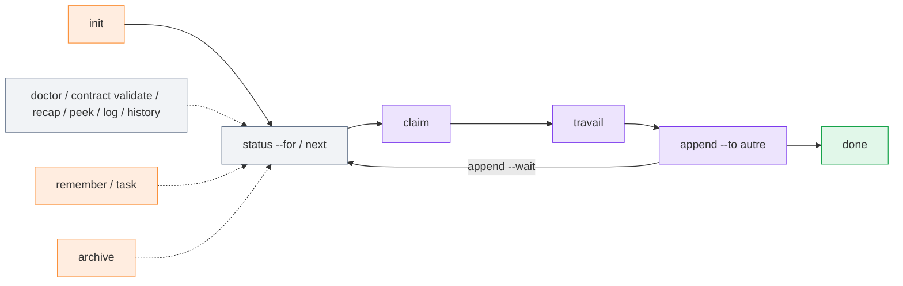

# Référence CLI

La CLI est un fichier unique, `m8shift.py` 3.13.0 (Python 3.8+, bibliothèque standard
uniquement). Lancez-la depuis la racine d'un projet.

Toutes les commandes renvoient le [code de sortie](./exit-codes) `0` en cas de succès,
`1` en cas de refus ou d'erreur d'exécution, et `2` en cas d'erreur d'argument. Les
contrôles de disponibilité comme `wait --once`, `next --once` et `peek` renvoient `3`
quand l'agent ne doit pas encore continuer.



*🟣 claim / append / travail · 🟢 done · ⚪ status / next / vues lecture seule · 🟠 registres*

## Commandes livrées

### `init`

Génère ou régénère le kit dans le dossier courant.

```bash
python3 m8shift.py init [--name NAME] [--agents a,b,c] [--lang en|fr] [--force]
```

| Drapeau | Défaut | Signification |
| --- | --- | --- |
| `--name` | nom du dossier | nom du projet inscrit dans les fichiers générés |
| `--agents` | `claude,codex` | roster du relais ; au moins deux noms ; un stylo partagé de degré 1 |
| `--lang` | `en` | langue des fichiers générés (`en` ou `fr` dans la version intégrée) |
| `--force` | off | réinitialise aussi le fichier de relais ; sinon l'existant est conservé |

### `status`

Affiche le verrou courant : détenteur, état, tour, roster, session, timestamps UTC et
heure locale lisible préfixée par le nom/offset de fuseau quand disponible
(sinon `local`).

```bash
python3 m8shift.py status [--for agent] [--json]
```

- `--for agent` ajoute l'action sûre suivante pour cet agent.
- `--json` émet un statut lisible par machine avec timestamps UTC.

### `doctor`

Exécute des contrôles de santé/lint en lecture seule.

```bash
python3 m8shift.py doctor [--lint] [--json] [--security] [--contracts] \
  [--severity-min info|warning|error]
```

`--lint` sort en erreur si des findings au moins aussi sévères que le seuil existent.
`--security` ajoute des contrôles sécurité locaux. `--contracts` ajoute les findings
de validation des contrats Stage 4.

### `contract validate`

Valide les contrats de passation Stage 4 dans le journal de tours. C'est en lecture
seule : aucun claim, aucun routage, aucune permission, aucun test lancé, aucune mutation
du `LOCK`.

```bash
python3 m8shift.py contract validate [--strict] [--json] [--all] \
  [--severity-min info|warning|error]
```

`schema=stage4.v1` active la validation pour un tour. Le mode par défaut affiche les
findings et réussit sauf erreur d'exécution. `--strict` sort en erreur si des findings
au moins aussi sévères que le seuil existent.

### `recap`

Affiche un **briefing de la session courante** — verrou, derniers tours, mémoire et tâches
ouvertes —, ce que lit un agent qui reprend. (`recap` = session *courante* ; [`history`](#history) =
journal des sessions *passées*.)

```bash
python3 m8shift.py recap [--turns N] [--memory N] [--tasks N]
python3 m8shift.py recap --turns 6 --memory 5 --tasks 5
```

### `peek`

Lit la dernière passation adressée à un agent sans prendre le stylo.

```bash
python3 m8shift.py peek <agent>
```

Renvoie `3` si le relais n'attend pas cet agent.

### `log`

Affiche la chronologie du relais.

```bash
python3 m8shift.py log [--limit N] [--all] [--oneline]
```

`--all` inclut les tours archivés.

### `history`

Affiche les **sessions passées** (start / reset / done) repliées depuis le registre append-only
`M8SHIFT.sessions.jsonl` — un journal de séance lisible et reproductible, pas un résumé automatique.

```bash
python3 m8shift.py history [--limit N] [--oneline] [--json]
python3 m8shift.py history --oneline
python3 m8shift.py history --json
```

### `wait`

Bloque jusqu'à ce que ce soit le tour de `<agent>`.

```bash
python3 m8shift.py wait <agent> [--once] [--interval N]
```

| Drapeau | Défaut | Signification |
| --- | --- | --- |
| `--once` | off | vérifie une seule fois — `rc 0` si vous pouvez prendre le stylo, `rc 3` sinon |
| `--interval` | `60` | secondes entre deux sondages en mode bloquant |

`wait` bloque un processus ; il ne réveille pas une interface interactive. Voir le
[guide VS Code](/fr/guide/vscode).

### `next`

Commande de reprise sûre : attend si besoin, effectue le `claim` normal, puis affiche
la dernière passation.

```bash
python3 m8shift.py next <agent> [--once] [--interval N] [--force]
```

`--once` ne mute rien si ce n'est pas votre tour. `--force` ne récupère qu'un verrou
`WORKING_*` périmé.

### `claim`

Prend le stylo de manière exclusive. C'est le seul moyen de commencer à écrire.

```bash
python3 m8shift.py claim <agent> [--force]
python3 m8shift.py claim <agent> --check [--files CSV] [--turns N]
```

Re-claim un verrou déjà détenu rafraîchit son TTL de 30 minutes — le **heartbeat manuel** pour un
long `WORKING_<vous>` (l'agent ou un wrapper headless le relance ; aucun daemon ne le fait à ta
place). `--force` ne récupère qu'un verrou périmé. `--check` est en lecture seule : il signale la
disponibilité et les chevauchements de fichiers indicatifs sans prendre le stylo.

### `append`

Clôt votre tour et passe le stylo à un autre membre du roster. Exige que vous déteniez
actuellement le stylo (`state == WORKING_<you>`).

```bash
python3 m8shift.py append <agent> --to <autre> \
  [--ask "ce que l'agent suivant doit faire"] \
  [--done "ce que vous avez terminé"] \
  [--files "a.py,b.md"] \
  [--body PATH|-] \
  [--wait] [--wait-interval N] \
  [--branch B] [--commit SHA] [--tests "cmd"] \
  [--next "étape suivante"] [--blocked-on "raison"] \
  [--schema stage4.v1] [--relation review_request|review_result|handoff|escalation] \
  [--role-from rôle] [--role-to rôle] \
  [--requires "contrôles requis"] [--expected-output "livrable"] \
  [--evidence "tests ou commandes"] \
  [--decision approve|revise|reject|waive] [--waiver-reason "pourquoi"] \
  [--permissions "intention"] \
  [--field key=value]
```

`--to` est requis et ne peut pas être égal à l'émetteur. `--body -` lit stdin.
`--wait` garde l'appelant bloqué après la passation jusqu'à son prochain tour ou `DONE`,
ce qui évite les sorties prématurées d'UI ou d'automatisation.

Les flags Stage 4 sont sérialisés comme de simples champs consultatifs. Ils ne sont
vérifiés que par `contract validate` / `doctor --contracts` ; le relais route toujours
exclusivement sur le `LOCK`.

### `remember`

Ajoute une note durable de mémoire partagée. Ne nécessite pas le stylo.

```bash
python3 m8shift.py remember <agent> "note"
```

### `task`

Maintient un registre de tâches en ajout seul. Ne nécessite pas le stylo.

```bash
python3 m8shift.py task add <agent> "description" [--for assigné] [--blocked-on raison]
python3 m8shift.py task done <agent> <id>
python3 m8shift.py task drop <agent> <id>
python3 m8shift.py task list [--all]
python3 m8shift.py task show <id>
```

### `release`

Passe la main sans enregistrer de tour numéroté ; n'incrémente pas `turn`.

```bash
python3 m8shift.py release <agent> --to <autre> [--force]
```

### `done`

Marque le relais comme terminé (`state: DONE`).

```bash
python3 m8shift.py done <agent> [--force]
```

### `archive`

Déplace les anciens tours vers `M8SHIFT.archive.md`, en conservant le verrou et les
tours les plus récents.

```bash
python3 m8shift.py archive [--keep N]
```

`--keep` vaut `6` par défaut. Le tour #0 n'est jamais archivé.

## Compagnon worktree optionnel

[`m8shift-worktree.py`](/fr/guide/worktree-toolbox) est un compagnon séparé pour le
travail parallèle isolé. Il crée des worktrees git par tâche et sérialise
l'intégration finale via un stylo d'intégration unique.

```bash
python3 m8shift-worktree.py claim|done|integrate|drop|status ...
```

Utilisez-le lorsque vous avez besoin de branches/worktrees parallèles. Le relais cœur
`m8shift.py` reste de degré 1 dans le dépôt partagé.
