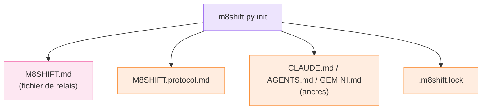

# Fichiers générés

`m8shift.py init` écrit un petit ensemble fixe de fichiers à la racine du projet. Les
nouveaux projets utilisent les noms `M8SHIFT.*` ; les projets créés avant le renommage
conservent leurs fichiers `COWORK.*`, qui sont détectés et lus automatiquement.

*🟣 init · 🩷 fichier de relais · 🟠 fichiers générés*

| Fichier | Rôle |
| --- | --- |
| `M8SHIFT.md` | verrou vivant, état du flux de travail et journal immuable des tours |
| `M8SHIFT.protocol.md` | le protocole partagé, généré depuis `m8shift.py` |
| `M8SHIFT.archive.md` | tours plus anciens déplacés ici par `archive` (créé à la demande) |
| `.m8shift.lock` | verrou de mutation inter-processus (`O_EXCL`) |
| `CLAUDE.md` | ancre Claude (strophe de protocole injectée en tête) |
| `AGENTS.md` | ancre Codex et agents génériques ; `AGENTS.override.md` est synchronisé s'il est présent |
| `GEMINI.md` | ancre Gemini, lorsque `gemini` est dans le roster |

::: tip Compatibilité héritée
Sur les projets existants, les équivalents `COWORK.md`, `COWORK.protocol.md`,
`COWORK.archive.md` et `.cowork.lock` continuent de fonctionner — `m8shift.py` lit à la fois
les nouveaux marqueurs `M8SHIFT:*` et les anciens `COWORK:*`. La strophe d'ancre est
idempotente : le fichier précédent est sauvegardé dans `<anchor>.cowork.bak` avant
injection.
:::

::: warning Non généré
Il n'existe pas de `M8SHIFT.memory.md`. La mémoire partagée (`remember` / `recap`) est une
fonctionnalité future spécifiée, qui ne fait pas partie de la sortie actuelle d'`init` —
voir la [feuille de route](/fr/roadmap).
:::
