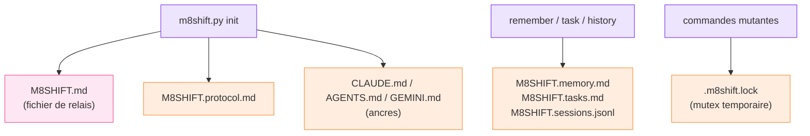

# Fichiers générés

`m8shift.py init` écrit les fichiers cœur du relais à la racine du projet. Les autres
registres sont créés à la demande par la commande qui les utilise. Les nouveaux projets
utilisent les noms `M8SHIFT.*` ; les projets créés avant le renommage conservent leurs
fichiers `COWORK.*`, qui sont détectés et lus automatiquement.

*🟣 init · 🩷 fichier de relais · 🟠 fichiers générés*

| Fichier | Rôle |
| --- | --- |
| `M8SHIFT.md` | verrou vivant, état du flux de travail et journal immuable des tours |
| `M8SHIFT.protocol.md` | le protocole partagé, généré depuis `m8shift.py` |
| `M8SHIFT.archive.md` | tours plus anciens déplacés ici par `archive` (créé à la demande) |
| `M8SHIFT.memory.md` | notes de mémoire partagée ajoutées par `remember` (créé à la demande) |
| `M8SHIFT.tasks.md` | événements de tâches en ajout seul ajoutés par `task` (créé à la demande) |
| `M8SHIFT.sessions.jsonl` | événements start/done de session utilisés par `history` (créé à la demande) |
| `.m8shift.lock` | verrou temporaire de mutation inter-processus (`O_EXCL`) |
| `CLAUDE.md` | ancre Claude (strophe de protocole injectée en tête) |
| `AGENTS.md` | ancre Codex et agents génériques ; `AGENTS.override.md` est synchronisé s'il est présent |
| `GEMINI.md` | ancre Gemini, lorsque `gemini` est dans le roster |

::: tip Compatibilité héritée
Sur les projets existants, les équivalents `COWORK.md`, `COWORK.protocol.md`,
`COWORK.archive.md` et `.cowork.lock` continuent de fonctionner — `m8shift.py` lit à la fois
les nouveaux marqueurs `M8SHIFT:*` et les anciens `COWORK:*`. La strophe d'ancre est
idempotente : le fichier précédent est sauvegardé dans `<anchor>.cowork.bak` avant
injection.
:::

::: tip Registres à la demande
`init` ne crée pas les fichiers de mémoire, tâches, archive ou sessions tant que les
commandes concernées n'en ont pas besoin. Leur absence signifie « aucune entrée pour
l'instant », pas une erreur.
:::
