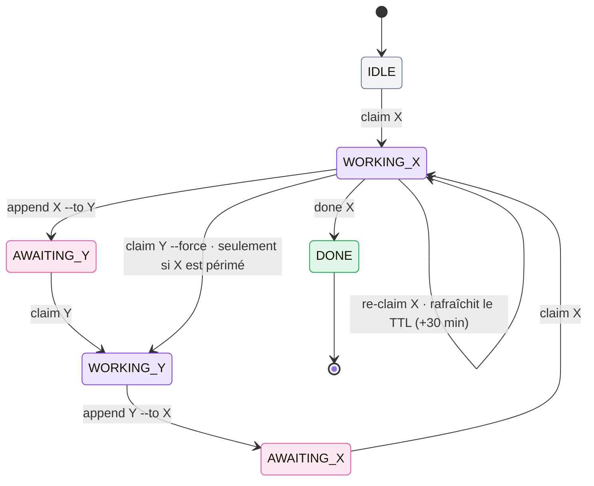

# Modèle d'état

Tout l'état du relais réside au même endroit : le **bloc de verrou** en tête de
`M8SHIFT.md` (`COWORK.md` sur les projets hérités), entre `<!-- M8SHIFT:LOCK:BEGIN -->` et
`<!-- M8SHIFT:LOCK:END -->`. Ce sont de simples lignes `key: value`, une par champ, ce qui
le maintient greppable et diffable.

```text
<!-- M8SHIFT:LOCK:BEGIN -->
holder: claude
state: WORKING_CLAUDE
agents: claude,codex
turn: 3
since: 2026-06-22T18:00:00Z
expires: 2026-06-22T18:30:00Z
note: -
lang: en
<!-- M8SHIFT:LOCK:END -->
```

## Champs du verrou

| Champ | Valeurs | Signification |
| --- | --- | --- |
| `holder` | un agent actif \| `none` | qui détient actuellement le stylo |
| `state` | `IDLE` \| `WORKING_<X>` \| `AWAITING_<X>` \| `DONE` | l'état du relais |
| `agents` | CSV, p. ex. `claude,codex` | le roster ; les **deux premiers** forment la paire active |
| `turn` | entier | numéro du dernier tour clos |
| `since` | ISO-8601 UTC | début de l'état courant |
| `expires` | ISO-8601 UTC \| `-` | échéance TTL ; porte une date **uniquement** pendant `WORKING_*` (30 min) |
| `note` | texte \| `-` | courte note facultative |
| `lang` | `en` \| `fr` | langue de la sortie générée |

## États

- **`IDLE`** — le stylo est libre ; n'importe qui dans la paire peut le réclamer.
- **`WORKING_<X>`** — l'agent X détient le stylo et est le seul autorisé à écrire.
- **`AWAITING_<X>`** — le stylo a été passé à X, qui est censé le réclamer et poursuivre.
- **`DONE`** — le relais est terminé.

## Transitions



*🟣 en cours · 🩷 en attente · ⚪ inactif · 🟢 fin*

- `claim` est la seule acquisition et elle est **exclusive** : deux réclamations
  simultanées donnent exactement un gagnant.
- `append` n'est accepté **que** depuis `WORKING_<self>`, et `--to` doit désigner l'autre agent.
- `claim --force` ne réclame un verrou **qu'**une fois qu'il a dépassé `expires` (périmé) ;
  il est refusé sur un verrou actif.

::: tip Spécifié, pas encore livré
Une machine à états par tâche plus riche (`PENDING`, `READY`, `BLOCKED`, `NEEDS_REVIEW`,
`APPROVED`…) relève de l'orientation multi-agent de la [feuille de route](/fr/roadmap), et
non du relais actuel.
:::
