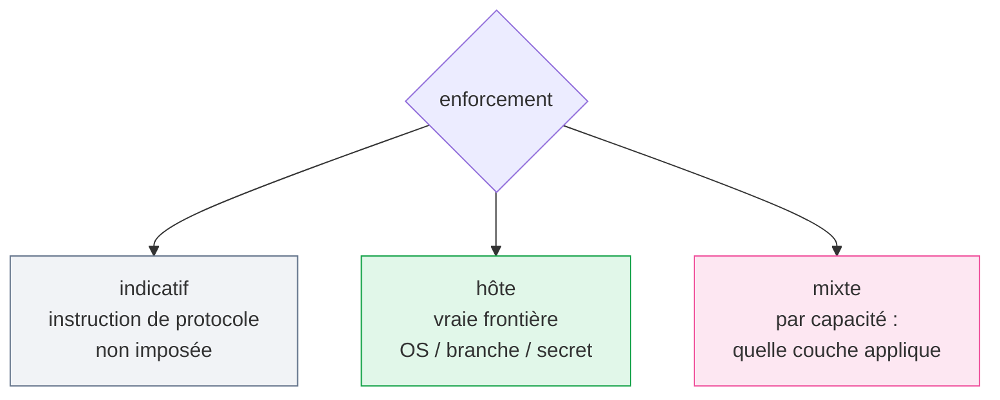

# Permissions

Exemple :

```yaml
permissions:
  enforcement: host
  allow:
    - repository.read
    - assets.write
    - image.generate
  deny:
    - source_code.write
    - secrets.read
    - remote.push
```

`advisory` signifie que l'agent est invité à se conformer. `host` signifie que
l'environnement applique réellement la frontière de capacités. `mixed` exige que chaque
capacité précise quelle couche l'applique.



*⚪ indicatif (pas une vraie frontière) · 🟢 hôte (vraie frontière) · 🩷 mixte*
