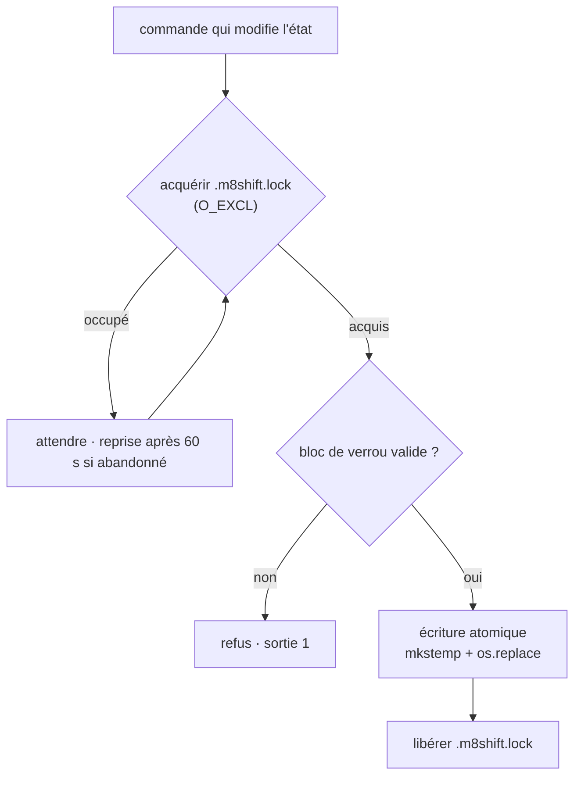

# Modèle de menaces

M8Shift est une couche de coordination **coopérative et indicative**. Elle atténue les
*erreurs de coordination* entre des agents qui suivent le protocole. Ce n'est pas un bac à
sable (sandbox) et elle ne contient pas d'agent malveillant ou compromis — c'est le rôle de
l'hôte (permissions du système de fichiers, protection de branche, cantonnement des secrets).

Toute commande qui modifie l'état passe par le même chemin sérialisé :

| Menace | Atténuation |
| --- | --- |
| Deux agents réclament le stylo en même temps | `claim` est exclusif via un fichier de verrou `O_EXCL` ; un seul l'emporte, l'autre attend |
| Un cycle lecture-modification-écriture entre en concurrence avec un autre processus | Chaque mutation est sérialisée par `.m8shift.lock` et écrite de façon atomique (`mkstemp` + `os.replace`) |
| Un détenteur planté laisse derrière lui le fichier de verrou | Le fichier de verrou porte un jeton de propriété et est récupéré après 60 s |
| Un détenteur bloque et fige le relais | Le verrou a un TTL de 30 minutes ; une fois `expires` dépassé, l'autre agent peut faire `claim --force` |
| Injection de marqueur dans un tour (faux `M8SHIFT:TURN`/`LOCK`/`STANZA`) | Les valeurs de champ rejettent les marqueurs réservés ; les corps en texte libre les neutralisent |
| Injection de saut de ligne dans des champs sur une seule ligne | `from`/`to`/`ask`/`done`/`files` rejettent les retours à la ligne |
| Une passation cible un agent hors du roster | `--to` est validé par rapport au roster déclaré ; les agents inconnus sont refusés (sortie `1`) |
| Un bloc de verrou corrompu ou invalide | Le verrou est analysé et validé avant toute écriture ; un état invalide est refusé, pas corrigé |

## Ce contre quoi M8Shift ne protège **pas**

- Un processus qui ignore le protocole et modifie directement les fichiers — le verrou est
  indicatif (`advisory`).
- Un agent qui ment sur les tests, les commits ou les pushs — ces affirmations doivent être
  vérifiées par l'agent ou l'hôte qui les a exécutés.
- L'accès au niveau du système d'exploitation : les permissions indicatives (`advisory`) sont
  des instructions de protocole, pas une application. Voir [permissions](./permissions).
- Les systèmes de fichiers réseau : `O_EXCL` et le renommage atomique sont moins fiables sur
  NFS ; visez un disque local.
