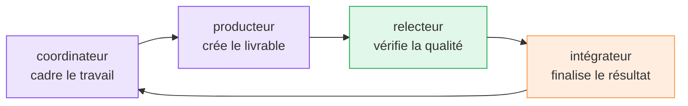

# Cas d'usage

M8Shift est conçu pour les workflows où un seul assistant IA ne suffit pas, ou lorsque
la séparation du travail entre rôles spécialisés produit de meilleurs résultats.

Au lieu de demander à un agent de tout faire en une seule passe, M8Shift permet à
plusieurs coéquipiers IA de collaborer avec une propriété claire du travail, des
passations, des notes de tâche et de la validation.

  <a class="m8-doc-card" href="#ecrire-un-livre">
    <i class="fa-solid fa-pen-fancy" aria-hidden="true"></i>
    <strong>Écriture</strong>
    Coordonner plan, rédaction, relecture, édition et nettoyage du manuscrit.
  </a>
  <a class="m8-doc-card" href="#construire-du-logiciel">
    <i class="fa-solid fa-terminal" aria-hidden="true"></i>
    <strong>Logiciel</strong>
    Séparer planification, implémentation, revue, tests, docs et notes de release.
  </a>
  <a class="m8-doc-card" href="#generer-de-la-documentation">
    <i class="fa-solid fa-book-open" aria-hidden="true"></i>
    <strong>Documentation</strong>
    Transformer des connaissances éparpillées en guides, références et onboarding.
  </a>
  <a class="m8-doc-card" href="#concevoir-un-site-web">
    <i class="fa-solid fa-layer-group" aria-hidden="true"></i>
    <strong>Sites web</strong>
    Coordonner architecture d'information, copy, docs, FAQ et contenus prêts à intégrer.
  </a>
  <a class="m8-doc-card" href="#creer-du-contenu-marketing-et-produit">
    <i class="fa-solid fa-bullhorn" aria-hidden="true"></i>
    <strong>Marketing</strong>
    Garder un message produit cohérent entre pages, annonces et comparaisons.
  </a>
  <a class="m8-doc-card" href="#recherche-et-synthese">
    <i class="fa-solid fa-magnifying-glass-chart" aria-hidden="true"></i>
    <strong>Recherche</strong>
    Collecter des sources, comparer des approches, identifier les risques et produire des notes.
  </a>
  <a class="m8-doc-card" href="#revue-et-controle-qualite">
    <i class="fa-solid fa-shield-halved" aria-hidden="true"></i>
    <strong>Revue</strong>
    Séparer production et validation pour éviter qu'un agent soit seul approbateur.
  </a>
  <a class="m8-doc-card" href="#automatiser-des-workflows-multi-etapes">
    <i class="fa-solid fa-gears" aria-hidden="true"></i>
    <strong>Automatisation</strong>
    Découper le travail en tours, suivre l'avancement, valider la sortie et finaliser proprement.
  </a>

## Écrire un livre

Utilisez M8Shift pour organiser des projets d'écriture longue avec plusieurs rôles :

- un coordinateur définit le concept, le public, les contraintes et le plan ;
- un rédacteur produit les sections ou les chapitres ;
- un relecteur vérifie la structure, le rythme, la cohérence et les manques ;
- un éditeur polit les fichiers Markdown ou le manuscrit final.

Workflow typique :

- définir le concept du livre et le public cible ;
- générer un plan détaillé ;
- écrire les chapitres section par section ;
- garder un ton, une terminologie et une structure cohérents ;
- relire la clarté, le rythme et les affirmations factuelles ;
- préparer des fichiers Markdown ou manuscrit prêts à exporter.

M8Shift évite le schéma "un énorme prompt, une réponse chaotique" en rendant chaque
tour plus ciblé, traçable et relisible.

## Construire du logiciel

M8Shift peut coordonner le travail de code entre rôles IA spécialisés :

- un planificateur découpe la fonctionnalité ;
- un codeur implémente les changements ;
- un relecteur inspecte le diff ;
- un testeur propose ou lance les validations ;
- un intégrateur prépare la passation finale, les notes de commit ou le texte de release.

Workflow typique :

- analyser le dépôt ;
- définir le plan de tâche ;
- créer ou modifier les fichiers source ;
- écrire ou mettre à jour les tests ;
- relire les diffs et les cas limites ;
- détecter les régressions ;
- préparer les messages de commit et la documentation.

Ce cas couvre les scripts d'automatisation, outils internes, sites web, utilitaires CLI
et projets plus larges où la correction compte plus qu'une réponse rapide unique.

## Générer de la documentation

M8Shift peut transformer des informations éparpillées en documentation structurée.

Workflow typique :

- générer la documentation du projet ;
- créer des guides d'installation et de configuration ;
- écrire des références API ou CLI ;
- maintenir changelogs et notes de release ;
- documenter les décisions d'architecture ;
- produire du matériel d'onboarding pour les contributeurs ;
- faire une revue technique avant publication.

La séparation importante est simple : un rôle écrit, un autre vérifie. La documentation
devra toujours être maintenue, mais la boucle de revue rend les dérives plus visibles.

## Concevoir un site web

M8Shift est utile pour les sites statiques en Markdown et les sites de documentation
développeur.

Workflow typique :

- définir la structure du site ;
- écrire la landing page ;
- créer des pages de cas d'usage ;
- rédiger les pages de documentation ;
- générer des sections FAQ ;
- relire la cohérence du message ;
- préparer du contenu pour VitePress, Astro, Docusaurus ou un framework similaire.

Un agent peut se concentrer sur l'architecture d'information, un autre sur le texte, un
autre sur l'exactitude technique, et un autre sur les détails d'implémentation.

## Créer du contenu marketing et produit

Utilisez M8Shift lorsque le message produit doit rester cohérent entre plusieurs pages
et formats.

Workflow typique :

- écrire des landing pages ;
- créer des descriptions produit ;
- générer des annonces de lancement ;
- rédiger des pages de comparaison ;
- préparer des posts sociaux ;
- produire des notes de release ;
- adapter le ton à différents publics.

Chaque rôle peut se concentrer sur un angle différent : clarté, persuasion, exactitude
technique ou cohérence de marque.

## Recherche et synthèse

M8Shift peut coordonner des workflows de recherche où l'information doit être collectée,
résumée, comparée, puis transformée en livrable exploitable.

Workflow typique :

- rassembler les sources ;
- extraire les points clés ;
- comparer plusieurs approches ;
- identifier les risques et compromis ;
- produire des synthèses ;
- générer des notes de décision ;
- préparer des rapports structurés.

Ce cas est utile pour la recherche technique, les décisions produit, l'analyse
concurrentielle et la gestion de connaissance interne.

## Revue et contrôle qualité

M8Shift sépare la production de la validation. L'agent qui crée un livrable n'a pas à
être le seul à l'approuver.

Workflow typique :

- relire du code généré ;
- vérifier l'exactitude d'une documentation ;
- valider le style rédactionnel ;
- détecter des exigences manquantes ;
- comparer le résultat aux règles du projet ;
- demander des corrections avant finalisation.

Le but : moins d'hypothèses non vérifiées, moins d'exigences oubliées et une trace plus
claire de ce qui est approuvé ou renvoyé en correction.

## Automatiser des workflows multi-étapes

M8Shift est utile quand une demande exige plusieurs étapes, différentes compétences ou
une délégation contrôlée entre agents.

Workflow typique :

- découper une demande complexe en tâches plus petites ;
- assigner chaque tâche au bon rôle ou agent ;
- suivre la progression dans le registre de tâches ;
- collecter les livrables ;
- valider les résultats ;
- produire le livrable final.

M8Shift convient ainsi à la production de contenu, au développement logiciel, à la
maintenance documentaire, à la préparation de sites web, à la recherche et à la
coordination de projet.

## Pourquoi c'est important

La plupart des outils IA rendent facile le fait de tout demander à un seul assistant.
M8Shift prend une autre approche : définir les rôles, séparer les responsabilités,
contrôler la fenêtre de travail et valider les résultats.

Cette structure devient importante lorsque les tâches sont trop grandes, trop sensibles
ou trop complexes pour un seul prompt.
