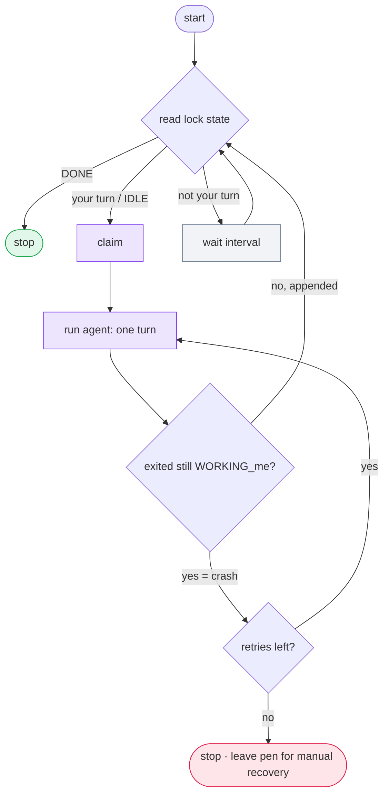

# Run a fully headless relay

`m8shift.py` is a **passive** coordinator. `wait` blocks a *process*; it cannot wake an
interactive agent UI. The only path to a hands-off relay is to drive a **headless** agent
CLI in a loop — for example `claude -p "<prompt>"` or `codex exec "<prompt>"` — where each
invocation performs exactly one turn (claim → work → append).

The command names are examples. Use the equivalent Gemini, Vibe, or other
cooperative agent CLI as long as each invocation performs exactly one M8Shift turn.

The repository ships a reference loop, `examples/headless_runner.py`, that runs **one**
agent. Run one instance per headless agent; if the other side is an interactive UI, a
human still resumes that side.

```bash
examples/headless_runner.py claude \
  --cmd claude -p "Apply M8SHIFT.protocol.md: take your turn (claim, work, append)." \
  --start-on-idle --interval 30 --max-retries 3
```



*🟣 claim & run agent · ⚪ wait · 🟢 done → stop · 🔴 leave pen for manual recovery*

## What a naïve `while wait; do …` loop gets wrong

The reference runner exists because the obvious loop has three bugs:

- **`wait` returns `0` for both "your turn" and `DONE`.** A naïve loop relaunches the
  agent forever once the relay is finished. The runner reads the lock `state` directly
  instead.
- **Two agents both starting from `IDLE`.** A single designated starter
  (`--start-on-idle`) breaks the tie.
- **A crashed turn.** If the agent exits while the pen is still `WORKING_<me>` (it claimed
  then died without `append`), that is a crash → retry up to a cap, then stop and leave
  the pen for manual recovery. The runner **never force-steals** the pen.
- **A long turn.** If a single turn can run past the 30-minute TTL, the wrapper should re-run
  `python3 m8shift.py claim <me>` periodically to refresh `expires` — a **manual heartbeat**;
  M8Shift never refreshes the lock for you.

It also uses bounded backoff and a static `argv` (no shell evaluation of the agent
command).

## When to use it

- Cron jobs, CI steps, or any unattended automation.
- A headless ↔ headless relay (both sides automated).
- A headless ↔ interactive mix, where one side is a CLI and the other a human-driven UI.

For interactive editor sessions, use the [VS Code guide](./vscode) instead.
