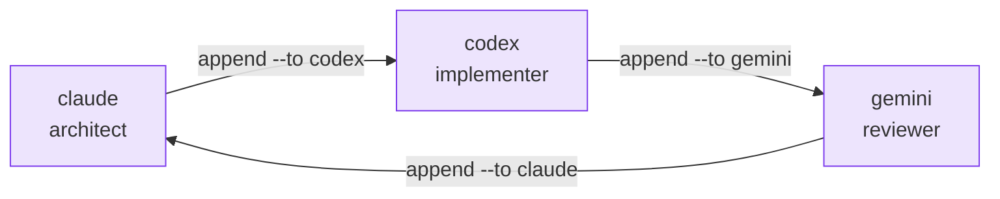

# Multi-agent workflow

M8Shift now supports a configurable roster with more than two agents, while keeping a
single shared pen. That is the important distinction:

- **shipped:** N agents can be named in `--agents`, and a turn can hand off to any other
  roster member;
- **still degree 1:** only one agent writes in the shared repository at a time;
- **parallel feature work:** use [`m8shift-worktree.py`](./worktree-toolbox), which
  creates isolated git worktrees and serializes integration through one integration pen.

```bash
python3 m8shift.py init --agents claude,codex,gemini
python3 m8shift.py next claude
python3 m8shift.py append claude --to codex --ask "Implement the parser." --done "Specified it."
python3 m8shift.py next codex
python3 m8shift.py append codex --to gemini --ask "Review implementation." --done "Implemented parser."
```



*🟣 N-agent roster · one shared pen*

## Roles are conventions

The core CLI records handoffs, asks, done summaries, files, branches, commits, tests,
and custom fields. It does not enforce role permissions or dependency graphs. If you
need an architect/reviewer/integrator split, write that contract into the `--ask`,
`--next`, task ledger, or protocol prompt.

## When you need real parallelism

Use the [worktree companion](./worktree-toolbox) for isolated branches:

```bash
python3 m8shift-worktree.py claim feature-parser codex --base main
python3 m8shift-worktree.py status
python3 m8shift-worktree.py integrate feature-parser claude --into main --to codex
```

The companion keeps feature work isolated and still serializes the merge/integration
step. It does not turn one shared directory into a safe multi-writer workspace.
