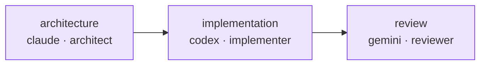

# Multi-agent workflow

::: warning Specified, not yet shipped
M8Shift ships a strict **two-agent** relay (a configurable pair, degree 1). The
role-and-dependency workflow below is a **specified** direction for more than two
simultaneous agents — it is a future RFC, not a runnable feature today. See the
[roadmap](/roadmap).
:::

A multi-agent workflow assigns roles and dependencies without requiring a permanent
manager hierarchy.

```yaml
workflow:
  coordinator: { agent: claude, role: coordinator }
  tasks:
    - id: architecture
      target: { agent: claude, role: architect }
    - id: implementation
      depends_on: { all: [architecture] }
      target: { agent: codex, role: implementer }
    - id: review
      depends_on: { all: [implementation] }
      target: { agent: gemini, role: reviewer }
```

That declaration is a dependency graph: each task waits for its prerequisites before its
target agent picks it up.



The coordinator is a role used for one phase. The same agent may later become the
integrator, but should not approve its own produced work when independent validation
is required.
