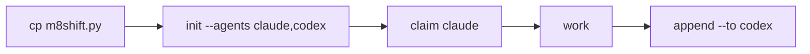

# Quickstart

::: warning Status
The commands below are the shipped two-agent relay. Richer multi-agent contracts remain
specification targets until implemented and tested — see the [roadmap](/roadmap).
:::

::: tip Naming
The CLI is `m8shift.py`. On projects created before the rename, `cowork.py` keeps working
as a thin compatibility shim and existing `COWORK.*` files are still read.
:::



*🟣 setup → first handoff*

Copy the CLI into a project:

```bash
cp m8shift.py /path/to/project/
cd /path/to/project
python3 m8shift.py init --agents claude,codex
```

Check the state:

```bash
python3 m8shift.py status
```

Claim before working:

```bash
python3 m8shift.py claim claude
```

Close the turn and hand off:

```bash
python3 m8shift.py append claude --to codex \
  --done "Defined the parser contract and added tests." \
  --ask "Implement the parser and preserve legacy behavior." \
  --files "docs/spec.md,tests/test_parser.py"
```

The next agent then runs:

```bash
python3 m8shift.py wait codex --once
python3 m8shift.py claim codex
```

## Golden rule

> Never modify the shared repository before a successful claim.
