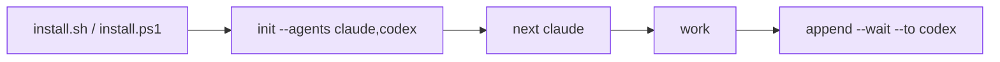

# Quickstart

::: tip Status
The commands below are the shipped degree-1 relay: one shared pen, any configured
roster member, one writer at a time. Use the
[worktree companion](./worktree-toolbox) only when you need isolated parallel feature
work.
:::

::: tip Naming
The CLI is `m8shift.py`; project files use `M8SHIFT.md` and `.m8shift.lock`.
:::

::: tip Agent names in examples
`claude` and `codex` are placeholders for the default roster. Use `gemini`, `vibe`,
or any other cooperative agent name if that agent can read its anchor, run the CLI,
and follow `claim → work → append`.
:::



*🟣 setup → first handoff*

Install M8Shift into a project on macOS, Linux, WSL, or Git Bash:

```bash
cd /path/to/project
curl -fsSL https://raw.githubusercontent.com/M8Shift/M8Shift/main/install.sh | bash -s -- --agents claude,codex
```

On native Windows PowerShell:

```powershell
cd C:\path\to\project
irm https://raw.githubusercontent.com/M8Shift/M8Shift/main/install.ps1 | iex
```

Prerequisites: Python 3.8+, Git for normal repository work, and one downloader
(`curl`, `wget`, or Python `urllib`). Verification uses `sha256sum`, `shasum`, or
Python `hashlib`.

The installers download `m8shift.py`, `m8shift-worktree.py`,
`m8shift-runtime.py`, and `m8shift-context.py` into the current directory, verify
them against `checksums.sha256`, then run `init`. They do not use `sudo`, do not
modify your global PATH, and do not start a background service.

For a pinned release, fetch the installer from the tag and pass the same ref:

```bash
curl -fsSL https://raw.githubusercontent.com/M8Shift/M8Shift/vX.Y.Z/install.sh | \
  bash -s -- --ref vX.Y.Z --agents claude,codex
```

```powershell
$env:M8SHIFT_INSTALL_REF = "vX.Y.Z"
irm https://raw.githubusercontent.com/M8Shift/M8Shift/vX.Y.Z/install.ps1 | iex
```

Download integrity (not a trust boundary): Bash and PowerShell both verify downloaded files by default
(`--no-verify` opts out) against the manifest from the selected ref. It catches corruption
or mismatch. For out-of-band trust against a compromised origin, pin reviewed digests
with `--sha256 FILE:HEX` or use a signed release tag.

Optional RTK shell-output filtering is explicit:

```bash
bash install.sh --with-rtk
```

The Bash installer downloads the matching RTK release asset for macOS, Linux, or
Git Bash/Windows, verifies it against RTK's `checksums.txt` from the same GitHub
release tag, installs it under `.m8shift/bin`, records local provenance, disables
telemetry, and identity-pins the adapter manifest. Cargo/Rust source builds are
disabled unless `--allow-source-build` is explicit.

The optional Headroom/Kompress context-compression adapter is installed with:

```bash
bash install.sh --with-headroom
```

It creates a native-arch venv in `.m8shift/venvs/headroom` with pinned `headroom-ai==0.28.0` + `onnxruntime==1.27.0` + `transformers==5.12.1`, preloads the `chopratejas/kompress-v2-base` model, and installs + identity-pins the `m8shift-headroom` launcher. Some platforms need Rust/Cargo for source builds; failure is reported but never blocks the base install. Once installed, compress via `python3 m8shift-context.py compress --backend headroom_ext` (opt-in, requires `--allow-project-local-adapters`; ~45–55% on prose, offline).

Review the install plan without writing files:

```bash
bash install.sh --dry-run --with-rtk --with-headroom
```

Prefer manual adoption? Copy `m8shift.py` into the project and run
`python3 m8shift.py init --agents claude,codex`.

To install the full kit in one command, add `--full`:

```bash
python3 m8shift.py init --agents claude,codex --full
```

The companions add runtime presence and progress sidecars, context packs, isolated
worktree lanes, the optional Headroom launcher, and language packs — all advisory,
while the core stays a single-file degree-1 relay. Copies are version-locked to the
core, idempotent, and never clobber an edited or newer file; use
`--companion-source <dir>` to copy from a release or checkout directory instead of
the directory holding `m8shift.py`.

Check the state:

```bash
python3 m8shift.py status --for claude
```

Since v3.45, `status` and `watch` print the project name, working directory, and
relay root in their header, so multiple terminals or tabs on different repositories
stay distinguishable. The label comes from `init --name "Project label"` when set,
falling back to the folder name.

Claim before working. In real agent loops, prefer `next`: it waits if needed,
then performs the normal `claim` and prints the latest handoff.

```bash
python3 m8shift.py next claude
```

Close the turn and hand off:

```bash
python3 m8shift.py append claude --to codex \
  --done "Defined the parser contract and added tests." \
  --ask "Implement the parser and preserve legacy behavior." \
  --files "docs/spec.md,tests/test_parser.py" \
  --wait
```

The next agent then runs:

```bash
python3 m8shift.py next codex
```

Before stopping a panel or automation loop, run `status --for <agent>`. If the relay
is not `DONE`, the safe action is to keep waiting, claim, append, release, or close
explicitly.

## Golden rule

> Never modify the shared repository before a successful claim.
