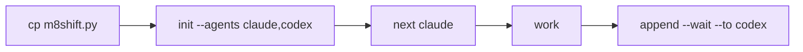

# Quickstart

::: tip Status
The commands below are the shipped degree-1 relay: one shared pen, any configured
roster member, one writer at a time. Use the worktree companion only when you need
isolated parallel feature work.
:::

::: tip Naming
The CLI is `m8shift.py`. On projects created before the rename, `cowork.py` keeps working
as a thin compatibility shim and existing `COWORK.*` files are still read.
:::



*🟣 setup → first handoff*

Copy the CLI into a project:

```bash
cp m8shift.py /path/to/project/
cd /path/to/project
python3 m8shift.py init --agents claude,codex
```

Check the state:

```bash
python3 m8shift.py status --for claude
```

Claim before working. In real agent loops, prefer `next`: it waits if needed,
then performs the normal `claim` and prints the latest handoff.

```bash
python3 m8shift.py next claude
```

Close the turn and hand off:

```bash
python3 m8shift.py append claude --to codex \
  --done "Defined the parser contract and added tests." \
  --ask "Implement the parser and preserve legacy behavior." \
  --files "docs/spec.md,tests/test_parser.py" \
  --wait
```

The next agent then runs:

```bash
python3 m8shift.py next codex
```

Before stopping a panel or automation loop, run `status --for <agent>`. If the relay
is not `DONE`, the safe action is to keep waiting, claim, append, release, or close
explicitly.

## Golden rule

> Never modify the shared repository before a successful claim.
