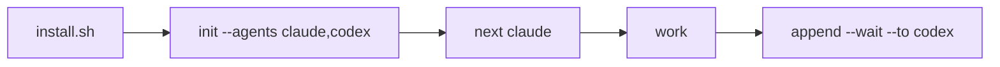

# Quickstart

::: tip Status
The commands below are the shipped degree-1 relay: one shared pen, any configured
roster member, one writer at a time. Use the worktree companion only when you need
isolated parallel feature work.
:::

::: tip Naming
The CLI is `m8shift.py`; project files use `M8SHIFT.md` and `.m8shift.lock`.
:::

::: tip Agent names in examples
`claude` and `codex` are placeholders for the default roster. Use `gemini`, `vibe`,
or any other cooperative agent name if that agent can read its anchor, run the CLI,
and follow `claim → work → append`.
:::



*🟣 setup → first handoff*

Install M8Shift into a project:

```bash
cd /path/to/project
curl -fsSL https://raw.githubusercontent.com/M8Shift/M8Shift/main/install.sh | bash -s -- --verify --agents claude,codex
```

The installer downloads `m8shift.py` and the `m8shift-worktree.py` toolbox into the
current directory, verifies them against `checksums.sha256`, then runs `init`. It
does not use `sudo`, does not modify your global PATH, and does not start a
background service.

For a pinned release, fetch the installer from the tag and pass the same ref:

```bash
curl -fsSL https://raw.githubusercontent.com/M8Shift/M8Shift/vX.Y.Z/install.sh | \
  bash -s -- --ref vX.Y.Z --verify --agents claude,codex
```

Prefer manual adoption? Copy `m8shift.py` into the project and run
`python3 m8shift.py init --agents claude,codex`.

Check the state:

```bash
python3 m8shift.py status --for claude
```

Claim before working. In real agent loops, prefer `next`: it waits if needed,
then performs the normal `claim` and prints the latest handoff.

```bash
python3 m8shift.py next claude
```

Close the turn and hand off:

```bash
python3 m8shift.py append claude --to codex \
  --done "Defined the parser contract and added tests." \
  --ask "Implement the parser and preserve legacy behavior." \
  --files "docs/spec.md,tests/test_parser.py" \
  --wait
```

The next agent then runs:

```bash
python3 m8shift.py next codex
```

Before stopping a panel or automation loop, run `status --for <agent>`. If the relay
is not `DONE`, the safe action is to keep waiting, claim, append, release, or close
explicitly.

## Golden rule

> Never modify the shared repository before a successful claim.
