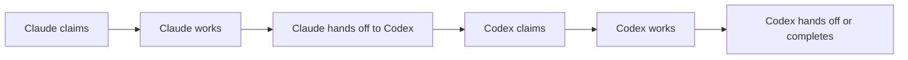

# Two-agent relay

The simplest M8Shift workflow uses two agents and one global pen:

This mode is deliberately sequential. Its value is not maximum throughput; it is
predictable ownership and a durable handoff trail.
