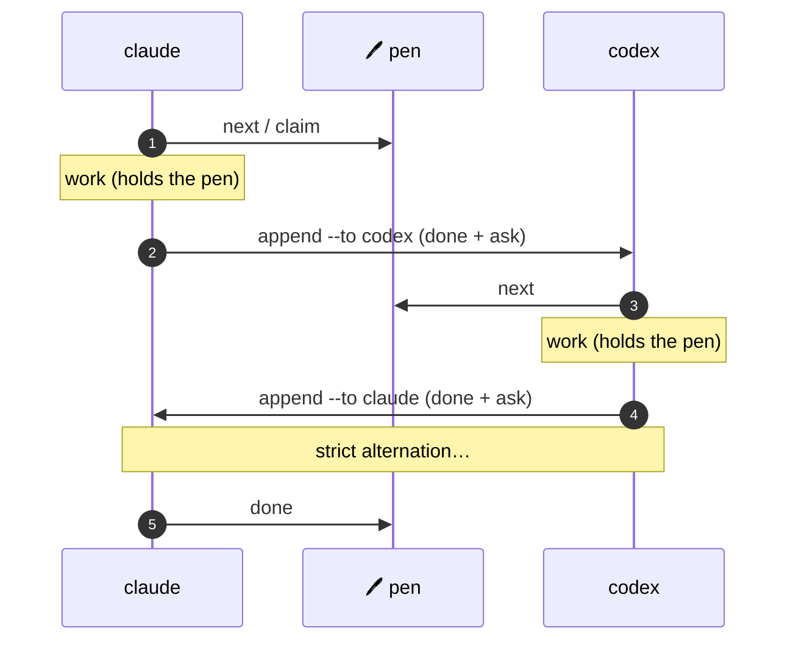

# Two-agent relay

The simplest M8Shift workflow uses two agents and one global pen.
It is deliberately sequential: its value is not throughput, but predictable ownership and
a durable handoff trail.

This page uses `claude` and `codex` as concrete example names. The same two-agent
loop works with `gemini`, `vibe`, or any cooperative agent pair that can run the
relay commands and respect the handoff.



*🟣 agents · 🩷 the pen*

## The full loop

Set up once:

```bash
cp m8shift.py /path/to/project/
cd /path/to/project
python3 m8shift.py init --agents claude,codex
```

Each agent repeats the same cycle. Claude's first turn:

```bash
python3 m8shift.py next claude         # wait if needed, then claim
# … edit files, run tests …
python3 m8shift.py append claude --to codex \
  --done "Added the parser contract and tests." \
  --ask "Implement the parser; keep legacy behaviour." \
  --files "docs/spec.md,tests/test_parser.py" \
  --wait
```

Codex then takes over:

```bash
python3 m8shift.py next codex
# … work …
python3 m8shift.py append codex --to claude --done "…" --ask "…" --wait
```

When the work is finished, the agent holding the pen closes the relay:

```bash
python3 m8shift.py done codex
```

## Golden rule

> Never modify the shared repository before a successful `claim`.

That single invariant is what makes the relay safe. See the [pen](/concepts/pen) and the
[state model](/reference/state-model) for what happens under the hood.
