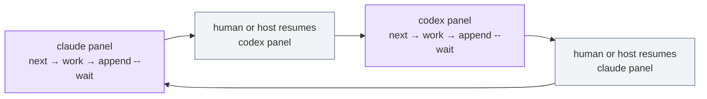

# Use M8Shift in VS Code

M8Shift can coordinate Claude and Codex running as panels inside VS Code — the panels
*are* the agents. The one thing to internalise: an interactive chat UI is **not** a
background process. `wait` blocks a shell; it cannot wake a sleeping conversation. A human
(or a host integration) resumes the next agent after each handoff.



*🟣 agent panels · ⚪ human resume (`wait` cannot wake a UI)*

## Setup

1. Open the repository in VS Code **on its root** — one window per repo.
2. Add the CLI and initialise:

   ```bash
   cp m8shift.py .
   python3 m8shift.py init --agents claude,codex
   ```

3. Run **Developer: Reload Window**, then start **new** conversations so each agent picks
   up its freshly injected anchor (`CLAUDE.md`, `AGENTS.md`).
4. Open both panels in the same window. For autonomy, put Codex in **Agent mode** and
   Claude in **auto-accept**.

## Bootstrapping the loop

Give each agent a short loop prompt, Claude first:

> Run `python3 m8shift.py next claude`. If it claims the pen, do exactly one scoped
> step, then `append claude --to codex --wait` with a clear `--ask`. Before any final
> answer to the human, run `python3 m8shift.py status --for claude`; if the relay is
> not `DONE`, keep following the safe next action.

Then Codex, symmetrically (`next codex`, `append codex --to claude --wait`,
`status --for codex`).

## Keeping it moving

- After each handoff, **resume the target panel**: "Resume the M8Shift loop from
  `python3 m8shift.py next <agent>`."
- Prefer `append --wait` when an agent hands off: it keeps that process blocked until
  its next turn or `DONE`, so a premature final message is harder to miss.
- Keep `M8SHIFT.md` open beside the source — the lock block tells you whose turn it is.
- Use `python3 m8shift.py status --for <agent>` whenever a human interrupts a panel; it
  prints the safe next action instead of relying on memory.
- If a panel crashed mid-turn and left a stale lock, recover with
  `python3 m8shift.py claim <agent> --force` (only works once the lock is past its
  30-minute TTL).

For unattended runs, use the [headless runner](./headless) instead of the IDE. M8Shift
stays the coordination primitive — it does not smuggle in a daemon under a fashionable
name.
