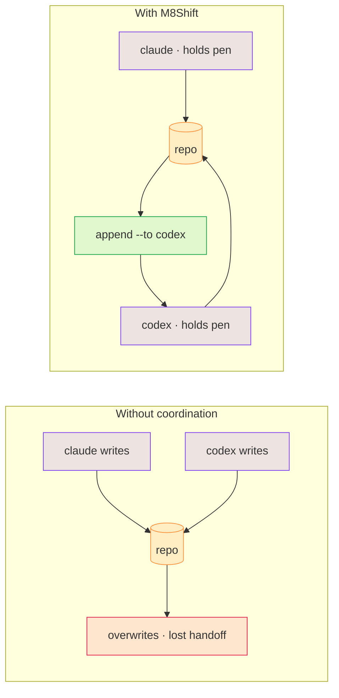

# Why M8Shift?

AI agents are effective individually, but shared repository work creates predictable
failure modes:

- concurrent edits overwrite or invalidate each other;
- one agent cannot tell whether another is still working;
- handoffs lose context between sessions;
- producers approve their own work;
- “parallel” tasks quietly share the same files;
- commits and test results are described more confidently than they occurred.

M8Shift addresses those points pragmatically today: explicit exclusive ownership (the
pen), an immutable turn journal, a claim-before-write rule, structured advisory fields,
shared memory, tasks, session history, loop guardrails, and an optional worktree companion
for [isolated parallel feature work](./worktree-toolbox). What it still does not do is
enforce a hosted runtime or a full dependency scheduler.

*🟣 agents · 🟠 repo · 🔴 overwrites · 🟢 handoff*

## Why multi-agent work helps

A single assistant is useful for a prompt-sized task: explain, summarize, draft, or make
one focused change. Longer work is different. It has planning, implementation, review,
correction, documentation, and final arbitration. When one agent tries to hold all of
that at once, the user often becomes the hidden project manager: re-prompting, copying
context, checking claims, and stitching partial outputs together.

Multi-agent work is useful when roles stay explicit:

  <a class="m8-doc-card" href="/use-cases#build-software">
    <i class="fa-solid fa-list-check" aria-hidden="true"></i>
    <strong>Long tasks need structure</strong>
    Planning, prioritizing, coding, testing, documenting, and releasing are different responsibilities. Splitting them makes the workflow easier to inspect.
  </a>
  <a class="m8-doc-card" href="/concepts/agents-roles">
    <i class="fa-solid fa-user-gear" aria-hidden="true"></i>
    <strong>Specialized roles reduce blur</strong>
    A planner, implementer, reviewer, editor, or tester can optimize for one job instead of producing one broad generic answer.
  </a>
  <a class="m8-doc-card" href="/concepts/handoff-contracts">
    <i class="fa-solid fa-people-arrows" aria-hidden="true"></i>
    <strong>Handoffs preserve context</strong>
    Each turn should say what changed, what evidence exists, and what the next agent is expected to do.
  </a>
  <a class="m8-doc-card" href="/concepts/validation">
    <i class="fa-solid fa-check-double" aria-hidden="true"></i>
    <strong>Review is a separate job</strong>
    The agent that produced the work should not be the only one validating it. A second pass catches missed requirements and weak assumptions.
  </a>

The trade-off is real: more agents can mean more cost, more chatter, and more chances
for agents to misunderstand each other. M8Shift's answer is intentionally narrow: it
does not try to be the runtime that launches or reasons for every agent. It gives the
shared repository a turn-taking protocol, a journal, and a human-readable trail so the
multi-agent workflow stays reviewable.

  <i class="fa-solid fa-book-open" aria-hidden="true"></i>
  

    <strong>Further reading</strong>
    
The French Liora article on <a href="https://liora.io/crew-ai-tout-savoir">CrewAI and multi-agent workflows</a> frames the broader pattern well: isolated assistants are strong on punctual tasks, while complex projects benefit from roles, coordination, shared context, and human arbitration.

  

## Different agents, by design

The point isn't to make agents interchangeable — it's to let *different* ones work together.
Claude, Codex, Gemini, Vibe and others have different strengths, different opinions, and they keep
evolving. When they review the same technical, writing, legal or design work, the **disagreement
between them is useful**: a second agent catches what the first missed, and the contradiction
surfaces a real choice instead of hiding it.

M8Shift keeps a human in that loop. The agents take turns and hand off context; the **final
decision stays human**. And because the coordination lives in one shared file at the repository
root, you stop **copy-pasting between siloed chat UIs** to keep agents in sync — they relay through
the repo, like teammates working in shifts, not rivals overwriting each other.

## What it is not

M8Shift is not a model provider, hosted gateway, memory platform, or universal agent
runtime. Full agent runtimes and gateways manage sessions, channels, tools, providers,
memory, and routing. M8Shift focuses on repository-level coordination and can complement
such a runtime rather than impersonating one.
