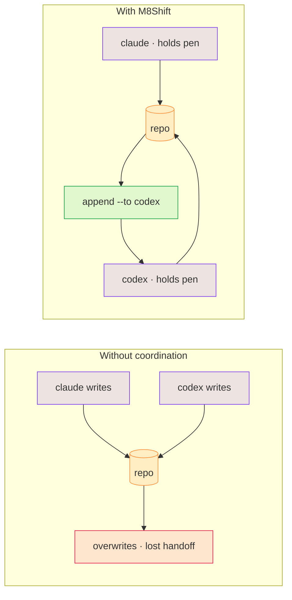

# Why M8Shift?

AI agents are effective individually, but shared repository work creates predictable
failure modes:

- concurrent edits overwrite or invalidate each other;
- one agent cannot tell whether another is still working;
- handoffs lose context between sessions;
- producers approve their own work;
- “parallel” tasks quietly share the same files;
- commits and test results are described more confidently than they occurred.

M8Shift addresses those points pragmatically today: explicit exclusive ownership (the
pen), an immutable turn journal, a claim-before-write rule, structured advisory fields,
shared memory, tasks, session history, loop guardrails, and an optional worktree companion
for [isolated parallel feature work](./worktree-toolbox). What it still does not do is
enforce a hosted runtime or a full dependency scheduler.

*🟣 agents · 🟠 repo · 🔴 overwrites · 🟢 handoff*

## Different agents, by design

The point isn't to make agents interchangeable — it's to let *different* ones work together.
Claude, Codex, Gemini, Vibe and others have different strengths, different opinions, and they keep
evolving. When they review the same technical, writing, legal or design work, the **disagreement
between them is useful**: a second agent catches what the first missed, and the contradiction
surfaces a real choice instead of hiding it.

M8Shift keeps a human in that loop. The agents take turns and hand off context; the **final
decision stays human**. And because the coordination lives in one shared file at the repository
root, you stop **copy-pasting between siloed chat UIs** to keep agents in sync — they relay through
the repo, like teammates working in shifts, not rivals overwriting each other.

## What it is not

M8Shift is not a model provider, hosted gateway, memory platform, or universal agent
runtime. Full agent runtimes and gateways manage sessions, channels, tools, providers,
memory, and routing. M8Shift focuses on repository-level coordination and can complement
such a runtime rather than impersonating one.
