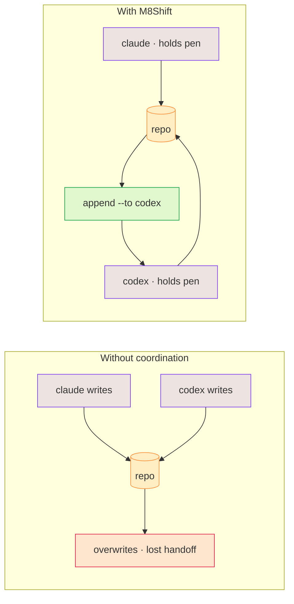

# Why M8Shift?

AI agents are effective individually, but shared repository work creates predictable
failure modes:

- concurrent edits overwrite or invalidate each other;
- one agent cannot tell whether another is still working;
- handoffs lose context between sessions;
- producers approve their own work;
- “parallel” tasks quietly share the same files;
- commits and test results are described more confidently than they occurred.

M8Shift addresses the first three directly today: explicit, exclusive ownership (the
pen), an immutable turn journal, and a claim-before-write rule. Richer answers to the
rest — structured contracts, dependency-aware tasks, and independent validation — are a
specified [roadmap](/roadmap) direction, not yet shipped.

*🟣 agents · 🟠 repo · 🔴 overwrites · 🟢 handoff*

## What it is not

M8Shift is not a model provider, hosted gateway, memory platform, or universal agent
runtime. Full agent runtimes and gateways manage sessions, channels, tools, providers,
memory, and routing. M8Shift focuses on repository-level coordination and can complement
such a runtime rather than impersonating one.
