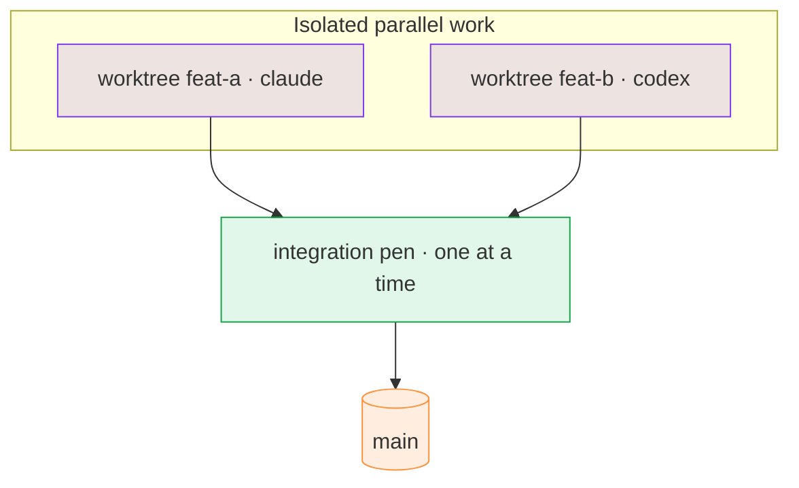

# Worktree toolbox

The M8Shift core is a **degree-1 pen**: agents take turns writing in **one shared working tree**,
one at a time. When you want **real isolated parallel work** — several agents building different
features at once — add the optional companion **`m8shift-worktree.py`**. It gives each task its own
git worktree and **serializes the merges** through a single integration pen, so two integrations can
never run at the same time.



*🟣 isolated worktrees · 🟢 one serialized integration pen · 🟠 target branch*

## Install — installer first, `init` second

The one-line installer downloads both `m8shift.py` and `m8shift-worktree.py`,
verifies them with `checksums.sha256`, then runs `init`:

```bash
cd /my/project
curl -fsSL https://raw.githubusercontent.com/M8Shift/M8Shift/main/install.sh | bash -s -- --verify --agents claude,codex
```

`python3 m8shift.py init` generates the relay (`M8SHIFT.md`, the protocol, the
anchors), but it does **not** copy scripts by itself. If you adopt manually, copy
**both** files into your project (or keep them on your `PATH`):

```bash
cp m8shift.py m8shift-worktree.py /my/project/   # the core + the toolbox
cd /my/project
python3 m8shift.py init                           # one-time relay setup (core only)
```

`m8shift-worktree.py` imports the core, so the two files live side by side.

## What it does (and does not)

- **Does:** one isolated git worktree per task (`.m8shift/worktrees/<id>`), a **serialized,
  crash-safe** integration that merges one feature at a time behind the canonical pen, and a clean
  handoff to the next agent.
- **Does not:** it is **not** an opaque auto-merge, it **never** deletes a worktree automatically
  (you confirm with `--yes`), and it runs **no background daemon**. Integration is an explicit,
  non-committing `git merge --no-ff --no-commit` that is verified before it commits, and every path
  hands the pen off — it never strands a half-merge.

## Commands

```bash
# start an isolated feature worktree off a base branch
python3 m8shift-worktree.py claim <id> <agent> --base <branch> [--branch <name>]

# note the task done (a dumb ledger line; the real handoff is `integrate`)
python3 m8shift-worktree.py done <id> <agent>

# serialized merge into a branch, then hand the pen to the next agent
python3 m8shift-worktree.py integrate <id> <agent> --into <branch> --to <next-agent>

# remove a feature worktree (never automatic)
python3 m8shift-worktree.py drop <id> <agent> --yes

# the canonical LOCK + the companion's worktrees
python3 m8shift-worktree.py status [<id>]
```

A short run:

```bash
python3 m8shift-worktree.py claim feat-parser codex --base main
# …codex works inside .m8shift/worktrees/feat-parser, commits there…
python3 m8shift-worktree.py integrate feat-parser claude --into main --to codex
python3 m8shift-worktree.py status
```

::: tip The integration target must be free
Git forbids the same branch in two worktrees, so the branch you `--into` must not be checked out in
your main checkout. Keep the canonical root **detached** (or on a coordination branch) so targets
like `main` are free for the dedicated integration worktree.
:::
